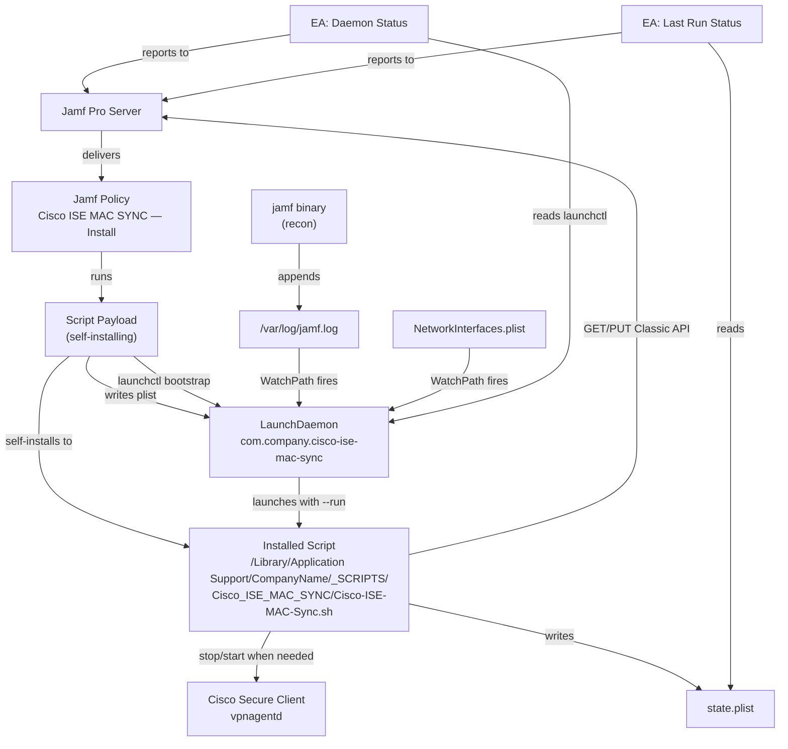
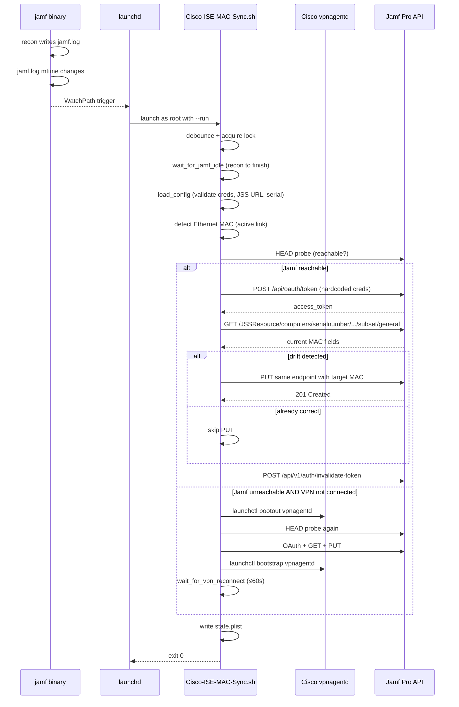

# Cisco ISE MAC SYNC — Deployment Guide

> **ℹ️ Note:** This guide is written for engineers new to MDM. Every
> MDM-specific term is linked to the [Apple Platform Glossary](../../apple-platform-glossary.md)
> on first mention. If a term is unfamiliar, click through before reading on.

**Script:** `Cisco-ISE-MAC-Sync.sh`
**Version documented:** `2.11`
**Author:** Heath Jones
**Last updated:** 2026-10-04
**Target platform:** macOS `13+` managed by [Jamf Pro](../../apple-platform-glossary.md#jamf-pro)

> **ℹ️ Paths and labels in this guide** assume the script's default org
> identity: `ORG_NAME_FRIENDLY="Company Name"` (path-safe `CompanyName`) and
> `ORG_PLIST_DOMAIN="com.company"`. If you change those in the main script,
> change them identically in the Cleanup script and both Extension
> Attributes, and read every `CompanyName` / `com.company` below as your values.

---

## 1. Overview

Cisco ISE authenticates Mac VPN sessions by looking up the device's MAC
address against the [Jamf Pro](../../apple-platform-glossary.md#jamf-pro)
inventory record. Whenever the [Jamf binary](../../apple-platform-glossary.md#jamf-binary)
runs an [Inventory Update (recon)](../../apple-platform-glossary.md#inventory-update-recon)
it overwrites the Jamf record's MAC fields with the *built-in* Wi-Fi
MAC, even when the Mac is using an Ethernet dongle — which causes ISE
lookups to fail and the user to lose VPN. This solution maintains the
Jamf primary and alternate MAC fields as the *currently active Ethernet
adapter* MAC by re-asserting the correct value via the [Classic API](../../apple-platform-glossary.md#jamf-pro-api)
after every recon and after every network interface state change. It is
[Cisco Secure Client](../../apple-platform-glossary.md#cisco-secure-client)
aware: when the VPN's Always-On policy makes Jamf unreachable, it stops
the VPN agent only long enough to push the update, then restarts it.

**What gets deployed:**
- `Cisco-ISE-MAC-Sync.sh` — single self-installing [Jamf Script payload](../../apple-platform-glossary.md#script-payload). Writes its own [LaunchDaemon](../../apple-platform-glossary.md#launchdaemon) plist via heredoc and bootstraps the daemon. OAuth credentials are embedded in the script source.
- `EA-Cisco-ISE-MAC-Sync-Daemon-Status.sh` — [Extension Attribute](../../apple-platform-glossary.md#extension-attribute-ea) reporting LaunchDaemon load state.
- `EA-Cisco-ISE-MAC-Sync-Last-Run-Status.sh` — Extension Attribute reporting the last run's outcome, MAC, interface, and timestamp.

> **🚨 Danger:** The OAuth `ClientID` and `ClientSecret` are baked into
> the script source. Anyone with **Read Scripts** permission in Jamf
> Pro can read them, and any local user with `cat` access to
> `/Library/Application Support/CompanyName/_SCRIPTS/Cisco_ISE_MAC_SYNC/Cisco-ISE-MAC-Sync.sh`
> can read them. Restrict the **Read Scripts** Jamf Pro privilege
> accordingly. Use a dedicated [API Role](../../apple-platform-glossary.md#api-role)
> with only `Read Computers` + `Update Computers` to limit blast radius
> on credential leak.

**What the end user sees:** Nothing — this runs silently. The only
visible side effect is a brief Cisco Secure Client reconnect (≤60s) on
Macs where Jamf is otherwise unreachable due to the VPN's Always-On
policy. Most runs complete in <10s with no VPN interaction.

**Runs as:** `root` (LaunchDaemon)

**Runs when:**
- `/var/log/jamf.log` is appended to (every recon)
- `NetworkInterfaces.plist` changes (Ethernet plug/unplug, dock connect)
- Every 5 minutes as a safety-net (`StartInterval`)

---

## 2. Architecture

### Component diagram



### Runtime sequence



### How the components relate

The deployment is a single self-installing [Jamf Policy](../../apple-platform-glossary.md#policy)
running one [Script payload](../../apple-platform-glossary.md#script-payload).
The first time the policy runs on a Mac, the script (which is executing
from a Jamf temp path) detects it is not yet at its canonical install
path and enters `--install` mode: it copies itself to
`/Library/Application Support/CompanyName/_SCRIPTS/Cisco_ISE_MAC_SYNC/Cisco-ISE-MAC-Sync.sh`,
writes the [LaunchDaemon](../../apple-platform-glossary.md#launchdaemon) plist
to `/Library/LaunchDaemons/com.company.cisco-ise-mac-sync.plist` via a
heredoc, and `launchctl bootstrap`s the daemon. There is no separate
package, no separate plist file, and no [Configuration Profile](../../apple-platform-glossary.md#configuration-profile)
to deliver.

After install, the LaunchDaemon owns the runtime. Its
[`WatchPaths`](../../apple-platform-glossary.md#watchpath) keys make
`launchd` fire the script every time `/var/log/jamf.log` gains a new
line (which happens during every recon) or the
`NetworkInterfaces.plist` is rewritten (every Ethernet adapter
plug/unplug). A 5-minute `StartInterval` provides a safety net in case
both triggers are missed. `ThrottleInterval` plus an in-script debounce
file double-protect against rapid `jamf.log` flap during a long recon.

The runtime script runs as `root` and follows a strict order: lock
acquisition, wait-for-jamf-idle (so we don't read pre-revert MAC
values from the server), credential validation (the embedded
`CLIENT_ID` / `CLIENT_SECRET` must not still hold their `REPLACE-*`
placeholder values), active-Ethernet selection, Jamf reachability
probe, then OAuth → GET → conditional PUT. The GET-then-PUT pattern
means the script skips the write entirely when the record is already
correct — keeping Jamf's edit history clean and reducing API load.

Two [Extension Attributes](../../apple-platform-glossary.md#extension-attribute-ea)
provide visibility back to Jamf inventory: Daemon Status reports
whether the LaunchDaemon is loaded; Last Run Status reads
`state.plist` (written at the end of every run) and reports outcome,
MAC, interface, and timestamp. Both are passive reads — they never
modify anything.

---

## 3. Component Inventory

### On-endpoint files

| Name | Path | Delivery mechanism | Purpose |
|---|---|---|---|
| `Cisco-ISE-MAC-Sync.sh` | `/Library/Application Support/CompanyName/_SCRIPTS/Cisco_ISE_MAC_SYNC/Cisco-ISE-MAC-Sync.sh` | Written by the script's own `--install` mode (`cp $0` from Jamf temp path) | Main script — selects active Ethernet MAC, asserts it on the Jamf record |
| `com.company.cisco-ise-mac-sync.plist` | `/Library/LaunchDaemons/com.company.cisco-ise-mac-sync.plist` | Written by the script's `--install` mode via heredoc | LaunchDaemon definition with `WatchPaths` and 5-min `StartInterval` |
| `state.plist` | `/Library/Application Support/CompanyName/_SCRIPTS/Cisco_ISE_MAC_SYNC/state.plist` | Written by script at the end of every run | Last-run outcome consumed by `EA-Cisco-ISE-MAC-Sync-Last-Run-Status.sh` |
| Dedicated log file | `/var/log/com.company.cisco-ise-mac-sync.log` | Written by script + LaunchDaemon `StandardOutPath` / `StandardErrorPath` | Persistent file log (script also logs to the [unified log](../../apple-platform-glossary.md#unified-log) via `logger`) |
| Lock file | `/var/run/com.company.cisco-ise-mac-sync.pid` | Written by script during run | Prevents overlapping runs |
| Debounce file | `/var/run/com.company.cisco-ise-mac-sync.debounce` | Written by script | Suppresses runs within 10s of the previous |

### Jamf Pro objects

| Object type | Name | Purpose | Lives at |
|---|---|---|---|
| [Script](../../apple-platform-glossary.md#script-payload) | `Cisco ISE MAC SYNC — Install` | The self-installing main script payload | `Settings → Computer Management → Scripts` |
| [Script](../../apple-platform-glossary.md#script-payload) | `Cisco ISE MAC SYNC — Uninstall` | Calls `Cisco-ISE-MAC-Sync.sh --uninstall` (Self Service remediation) | `Settings → Computer Management → Scripts` |
| [Policy](../../apple-platform-glossary.md#policy) | `Cisco ISE MAC SYNC — Install` | Deploys the install script to scoped Macs | `Computers → Policies` |
| [Policy](../../apple-platform-glossary.md#policy) | `Cisco ISE MAC SYNC — Uninstall (Self Service)` | Surfaces uninstall remediation in Self Service | `Computers → Policies` |
| [Extension Attribute](../../apple-platform-glossary.md#extension-attribute-ea) | `Cisco ISE MAC SYNC — Daemon Status` | Reports `Loaded` / `NotLoaded` / `Missing` | `Settings → Computer Management → Extension Attributes` |
| [Extension Attribute](../../apple-platform-glossary.md#extension-attribute-ea) | `Cisco ISE MAC SYNC — Last Run Status` | Reports last run outcome `<status> \| <mac> \| <iface> \| <ts>` | `Settings → Computer Management → Extension Attributes` |
| [Smart Group](../../apple-platform-glossary.md#smart-group) | `Cisco ISE MAC SYNC — Eligible (No Daemon)` | Scopes the install Policy to Macs that need it | `Computers → Smart Computer Groups` |
| [Smart Group](../../apple-platform-glossary.md#smart-group) | `Cisco ISE MAC SYNC — Failure Last Run` | Triage view for Macs whose last run errored | `Computers → Smart Computer Groups` |
| [API Role](../../apple-platform-glossary.md#api-role) | `Cisco ISE MAC SYNC` | Grants the minimum read/update privileges on Computers | `Settings → System → API roles and clients` |
| [API Client](../../apple-platform-glossary.md#api-client) | `cisco-ise-mac-sync` | OAuth client credentials embedded in the script | `Settings → System → API roles and clients` |
| [Category](../../apple-platform-glossary.md#category) | `Networking` (or your equivalent) | Organizes the policies | `Settings → Global → Categories` |

### Script parameters

The Jamf Script payload takes one **optional** Jamf script parameter:
`$4` = mode override (`install` or `uninstall`; blank = `install`).
All other configuration is embedded in the script source.

The script itself accepts a single positional argument controlling mode.
The Jamf Script payload invocation (where `$1` is the mount point `/`)
is also detected and routed to `--install`:

| Position | Value | Source | Purpose |
|---|---|---|---|
| `$1` | `/` (mount point) | Jamf Script payload | Inferred → `--install` |
| `$1` | `--install` | Direct CLI / re-bootstrap | Run install + bootstrap (idempotent) |
| `$1` | `--run` | LaunchDaemon `ProgramArguments` | Normal scheduled run |
| `$1` | `--uninstall` | Self Service uninstall Policy | Removes daemon, install dir, log, lock files |
| `$1` | `--status` | Manual diagnostic | Prints `state.plist` to stdout |

### Embedded credentials

The script has two `readonly` constants in its Core Defined Variables block:

```bash
readonly CLIENT_ID="REPLACE-WITH-JAMF-API-CLIENT-ID"
readonly CLIENT_SECRET="REPLACE-WITH-JAMF-API-CLIENT-SECRET"
```

You **must** edit the script source and replace both values before
uploading the script payload to Jamf. The runtime `load_config()`
function checks for the `REPLACE-*` prefix and aborts with state
`creds_missing` if the placeholders haven't been replaced.

---

## 4. Dependencies and Prerequisites

### 4.1 Endpoint binaries

| Binary | Required version | Install mechanism | Detection command |
|---|---|---|---|
| `jq` | `1.6+` | Baseline managed (most fleets ship `jq` via a `Install jq` Policy or Homebrew bootstrap) | `which jq && jq --version` |
| `xmllint` | bundled with macOS | Built in — no install required | `which xmllint` |
| `curl` | bundled with macOS | Built in | `curl --version \| head -1` |
| Cisco Secure Client (or AnyConnect) | optional | If absent, VPN-aware logic is auto-disabled | `ls /opt/cisco/secureclient/bin/vpn /opt/cisco/anyconnect/bin/vpn 2>/dev/null` |

### 4.2 Prerequisite Jamf Pro objects

These must exist before the install Policy is created or the deployment will fail.

- [ ] [Category](../../apple-platform-glossary.md#category) `Networking` (or your chosen category)
- [ ] [API Role](../../apple-platform-glossary.md#api-role) `Cisco ISE MAC SYNC` with privileges:
  - `Read Computers`
  - `Update Computers`
- [ ] [API Client](../../apple-platform-glossary.md#api-client) `cisco-ise-mac-sync` issued against that role; record the `Client ID` and `Client Secret` to paste into the script body
- [ ] [Extension Attribute](../../apple-platform-glossary.md#extension-attribute-ea) `Cisco ISE MAC SYNC — Daemon Status` created (the install Smart Group depends on its values)
- [ ] [Extension Attribute](../../apple-platform-glossary.md#extension-attribute-ea) `Cisco ISE MAC SYNC — Last Run Status` created
- [ ] [Smart Group](../../apple-platform-glossary.md#smart-group) `Cisco ISE MAC SYNC — Eligible (No Daemon)` populated

### 4.3 Network reachability

The endpoint must be able to reach every URL listed below. Validate
with the `curl` command shown.

| URL | Purpose | Validation |
|---|---|---|
| `https://<jamf-instance>.jamfcloud.com/api/oauth/token` | OAuth token request | `curl -sI https://<jamf-instance>.jamfcloud.com/api/oauth/token \| head -1` |
| `https://<jamf-instance>.jamfcloud.com/api/v1/auth/invalidate-token` | Token invalidation | covered by base host reachability |
| `https://<jamf-instance>.jamfcloud.com/JSSResource/computers/serialnumber/...` | Classic API GET/PUT MAC fields | covered by base host reachability |

**Web proxy / [PAC file](../../apple-platform-glossary.md#pac-file) entries:** Most fleets bypass `*.jamfcloud.com` from any cloud proxy tunnel; if your PAC routes Jamf through the proxy, ensure the proxy permits `POST` to `/api/oauth/token` and `PUT` to `/JSSResource/...`.

### 4.4 Credentials and secrets

| Credential | Type | Delivery | Rotation |
|---|---|---|---|
| Jamf API Client ID | UUID | Hardcoded in script `CLIENT_ID` constant | Edit the script, upload to Jamf, re-run install Policy — install function overwrites the on-disk copy and reloads the daemon |
| Jamf API Client Secret | OAuth secret | Hardcoded in script `CLIENT_SECRET` constant | Same procedure as above |

> **🚨 Danger:** Anyone with **Read Scripts** permission in Jamf Pro
> can read these credentials. Audit who holds that privilege
> (`Settings → System → Jamf Pro User Accounts & Groups`) before
> deploying. The credentials are also written to disk inside the
> installed copy at `/Library/Application Support/CompanyName/_SCRIPTS/Cisco_ISE_MAC_SYNC/Cisco-ISE-MAC-Sync.sh`
> (mode `0755`) — any local user with `cat` access will see them.
> The dedicated API Client should hold only `Read Computers` +
> `Update Computers` to bound the blast radius.

---

## 5. Pre-Deployment Checklist

- [ ] Script `Cisco-ISE-MAC-Sync.sh` v2.11 has been reviewed and tested locally (Section 6.1)
- [ ] All Section 4 dependencies are satisfied
- [ ] A test computer exists in a test [Smart Group](../../apple-platform-glossary.md#smart-group) scoped for this Policy
- [ ] You have privileges to create Scripts, Extension Attributes, Smart Groups, API Roles, and Policies in Jamf Pro
- [ ] You have generated a fresh `Client ID` and `Client Secret` for the dedicated API Client
- [ ] You have edited the script source and replaced both `REPLACE-WITH-*` placeholders with the real `Client ID` and `Client Secret`
- [ ] The [Category](../../apple-platform-glossary.md#category) `Networking` exists
- [ ] You have access to `/var/log/jamf.log` and the [unified log](../../apple-platform-glossary.md#unified-log) on the test Mac for verification

---

## 6. Deployment Procedure

### 6.1 Local testing before uploading to Jamf

Before putting anything in Jamf Pro, verify the script runs on a test Mac.

```bash
# Edit the script to replace both REPLACE-WITH-* placeholders with real values
sed -i '' 's/REPLACE-WITH-JAMF-API-CLIENT-ID/<your-client-id>/' Scripts/Cisco-ISE-MAC-Sync.sh
sed -i '' 's/REPLACE-WITH-JAMF-API-CLIENT-SECRET/<your-client-secret>/' Scripts/Cisco-ISE-MAC-Sync.sh

# Run the script's install mode directly
sudo Scripts/Cisco-ISE-MAC-Sync.sh --install

# Tail the script log in a second tab
sudo tail -f /var/log/com.company.cisco-ise-mac-sync.log

# Trigger the script via WatchPath (writes to jamf.log)
sudo jamf recon

# Read the last-run state
sudo "/Library/Application Support/CompanyName/_SCRIPTS/Cisco_ISE_MAC_SYNC/Cisco-ISE-MAC-Sync.sh" --status
```

Expected outcomes:
- `--install` exits `0` and logs `Install complete. LaunchDaemon … is loaded`
- After `sudo jamf recon`, the daemon fires within ~10s
- Unified log shows `[INFO] Cisco-ISE-MAC-Sync.sh v2.11 starting (PID …)`
- Either `[INFO] Jamf record already correct …` (no PUT) or `[INFO] Jamf record updated: primary=alt=<mac>`
- `state.plist` exists and `LastRunStatus` reads `success` or `success_nochange`

If the script fails locally, fix before proceeding. Do **not** upload a broken script to Jamf.

> **✅ Tip:** Force a MAC drift to exercise the PUT path: in Jamf Pro,
> manually edit the test Mac's `MAC Address` to a fake value
> (`00:00:5E:00:53:01`, a documentation-range MAC), then `sudo jamf recon`. The script should
> detect the drift, PUT the correct MAC, and report `success`.

> **🚨 Danger:** After local testing, do **not** commit the edited
> script (with real credentials) to a public repo. Either keep the
> credentialed copy local-only, or use a gitignored sidecar.

### 6.2 Create the [API Role](../../apple-platform-glossary.md#api-role) and [API Client](../../apple-platform-glossary.md#api-client)

1. In Jamf Pro, go to **Settings → System → API roles and clients**.
2. **API Roles** tab → **+ New**:
   - **Display Name:** `Cisco ISE MAC SYNC`
   - **Privileges:** add `Read Computers` and `Update Computers`
   - **Save**
3. **API Clients** tab → **+ New**:
   - **Display Name:** `cisco-ise-mac-sync`
   - **API Roles:** select `Cisco ISE MAC SYNC`
   - **Access Token Lifetime:** `300` seconds (default is fine)
   - **Save**, then click **Enable**.
4. Click **Generate Client Secret** and copy both `Client ID` and the freshly-generated `Client Secret` — you'll paste them into the script in 6.4. The secret will not be shown again.

> **🚨 Danger:** If you lose the secret, you must rotate it. Never
> store it in Slack, email, the Jamf Notes field, or commit it to a
> repo.

### 6.3 Create the [Extension Attributes](../../apple-platform-glossary.md#extension-attribute-ea)

Repeat the procedure below for both EA scripts.

1. Go to **Settings → Computer Management → Extension Attributes → + New**.
2. **Display Name:** `Cisco ISE MAC SYNC — Daemon Status`
3. **Description:** `Reports whether the Cisco ISE MAC SYNC LaunchDaemon is loaded.`
4. **Data Type:** `String`
5. **Inventory Display:** `Extension Attributes`
6. **Input Type:** `Script`
7. Paste the contents of `ExtensionAttributes/EA-Cisco-ISE-MAC-Sync-Daemon-Status.sh`.
8. Click **Save**.

Repeat for `EA-Cisco-ISE-MAC-Sync-Last-Run-Status.sh`:
- **Display Name:** `Cisco ISE MAC SYNC — Last Run Status`
- **Description:** `Reports outcome of the last Cisco ISE MAC SYNC run as "<status> | <mac> | <iface> | <timestamp>".`

After both are saved, trigger a recon on the test Mac:

```bash
sudo jamf recon
```

Verify the EAs populate at `Computers → Search Inventory → <test computer> → Extension Attributes`.

### 6.4 Create the [Smart Group](../../apple-platform-glossary.md#smart-group) — `Cisco ISE MAC SYNC — Eligible (No Daemon)`

This Smart Group scopes the install Policy.

1. Go to **Computers → Smart Computer Groups → + New**.
2. **Display Name:** `Cisco ISE MAC SYNC — Eligible (No Daemon)`
3. **Criteria** tab:
   - `Cisco ISE MAC SYNC — Daemon Status` `is not` `Loaded`
   - `and` `Operating System Version` `like` `13.` (or `14.` / `15.` per fleet baseline)
   - `and` (any membership criteria that defines who *should* have this — e.g. `Department` `like` `Engineering`)
4. **Save**. Membership populates as inventories update.

(Optional — create a triage Smart Group for failures.)

1. **+ New** → **Display Name:** `Cisco ISE MAC SYNC — Failure Last Run`
2. **Criteria:**
   - `Cisco ISE MAC SYNC — Last Run Status` `does not have` `success`
   - `and` `Cisco ISE MAC SYNC — Last Run Status` `does not have` `success_nochange`
   - `and` `Cisco ISE MAC SYNC — Daemon Status` `is` `Loaded`

### 6.5 Create the install [Script payload](../../apple-platform-glossary.md#script-payload)

The script is fully self-contained — no wrapper or heredoc rebuild is
required. You paste the verbatim contents of `Cisco-ISE-MAC-Sync.sh`
(with the two credential placeholders replaced).

1. Open a local copy of `Scripts/Cisco-ISE-MAC-Sync.sh` in your editor.
2. Replace `REPLACE-WITH-JAMF-API-CLIENT-ID` with the `Client ID` from step 6.2.4.
3. Replace `REPLACE-WITH-JAMF-API-CLIENT-SECRET` with the `Client Secret` from step 6.2.4.
4. In Jamf Pro: **Settings → Computer Management → Scripts → + New**.
5. **General** tab:
   - **Display Name:** `Cisco ISE MAC SYNC — Install`
   - **Category:** `Networking`
   - **Notes:** Link to this Confluence guide.
6. **Script** tab: paste the entire edited script, including the shebang and the Script Information Block banners.
7. **Options** tab:
   - **Priority:** `After`
   - **Parameter Labels:** leave blank — the script does not use Jamf parameters.
8. **Save**.

> **✅ Tip:** Keep two copies of the script source: a sanitized one
> (with `REPLACE-WITH-*` placeholders intact) checked into source
> control, and a credentialed one used only for the Jamf upload.
> Never check the credentialed copy in.

### 6.6 Create the uninstall [Script payload](../../apple-platform-glossary.md#script-payload)

1. Go to **Settings → Computer Management → Scripts → + New**.
2. **General** tab:
   - **Display Name:** `Cisco ISE MAC SYNC — Uninstall`
   - **Category:** `Networking`
3. **Script** tab — a one-liner that calls the main script's `--uninstall` mode (with a fallback to manual cleanup if the script is missing):

   ```bash
   #! /bin/bash
   set -euo pipefail

   SCRIPT="/Library/Application Support/CompanyName/_SCRIPTS/Cisco_ISE_MAC_SYNC/Cisco-ISE-MAC-Sync.sh"
   BUNDLE_ID="com.company.cisco-ise-mac-sync"

   if [[ -x "${SCRIPT}" ]]
   then
       "${SCRIPT}" --uninstall
       exit $?
   fi

   # Fallback: script missing — clean up by hand
   if launchctl print "system/${BUNDLE_ID}" >/dev/null 2>&1
   then
       launchctl bootout "system/${BUNDLE_ID}" 2>/dev/null || true
   fi
   rm -f "/Library/LaunchDaemons/${BUNDLE_ID}.plist"
   rm -rf "/Library/Application Support/CompanyName/_SCRIPTS/Cisco_ISE_MAC_SYNC"
   rm -f "/var/log/${BUNDLE_ID}.log"
   rm -f "/var/run/${BUNDLE_ID}.pid" "/var/run/${BUNDLE_ID}.debounce"

   exit 0
   ```

4. **Options** tab → **Priority:** `After` → **Save**.

### 6.7 Create the install [Policy](../../apple-platform-glossary.md#policy)

1. Go to **Computers → Policies → + New**.
2. **General** payload:
   - **Display Name:** `Cisco ISE MAC SYNC — Install`
   - **Enabled:** checked
   - **Category:** `Networking`
   - **Trigger:** check `Recurring Check-in` and `Enrollment Complete`
   - **Execution Frequency:** `Once per computer`
3. **Scripts** payload → **Configure → Add** → select `Cisco ISE MAC SYNC — Install`. Set **Priority** to `After`. Leave parameters blank.
4. **Maintenance** payload → **Configure** → check `Update Inventory`. (This forces an Inventory Update on the same check-in so the EAs report immediately and the Smart Group recalculates.)
5. **Scope** tab:
   - **Targets** → **+ Add** → **Computer Groups** → select `Cisco ISE MAC SYNC — Eligible (No Daemon)`
   - **Exclusions** → add your `Jamf Admin Test Fleet` exclusion if you have one
6. **Save**.

### 6.8 Create the Self Service uninstall [Policy](../../apple-platform-glossary.md#policy)

1. **Computers → Policies → + New**.
2. **General** payload:
   - **Display Name:** `Cisco ISE MAC SYNC — Uninstall (Self Service)`
   - **Enabled:** checked
   - **Category:** `Networking`
   - **Trigger:** none (Self Service only)
   - **Execution Frequency:** `Ongoing`
3. **Scripts** payload → **Add** → select `Cisco ISE MAC SYNC — Uninstall`. **Priority:** `After`.
4. **Maintenance** payload → check `Update Inventory`.
5. **Scope** → target the broader fleet that *might* need to remediate (typically the same Smart Group inverted, or just `All Managed Clients`).
6. **Self Service** tab:
   - Check **Make the policy available in Self Service**.
   - **Display Name:** `Reset Cisco ISE MAC SYNC`
   - **Button Name Before Execution:** `Reset`
   - **Description:** `If your VPN is failing because Jamf has the wrong MAC address for this Mac, click Reset to remove the Cisco ISE MAC SYNC daemon. The next inventory check-in will reinstall it cleanly.`
   - **Categories:** `Troubleshooting` (or your equivalent)
7. **Save**.

---

## 7. Validation / Smoke Test

After deploying to the test Smart Group, verify on at least one test Mac.

### On the test Mac

```bash
# Force a check-in to pull the install Policy
sudo jamf policy

# Inspect the Jamf policy log
sudo tail -50 /var/log/jamf.log

# Confirm the LaunchDaemon was bootstrapped
sudo launchctl print system/com.company.cisco-ise-mac-sync | head -20

# Confirm the on-disk artifacts
ls -la "/Library/Application Support/CompanyName/_SCRIPTS/Cisco_ISE_MAC_SYNC/"
ls -la /Library/LaunchDaemons/com.company.cisco-ise-mac-sync.plist

# Trigger a real run (touch jamf.log via recon)
sudo jamf recon

# Tail the script log live (keep this open while triggering recon)
sudo tail -f /var/log/com.company.cisco-ise-mac-sync.log

# Read the last-run state
sudo "/Library/Application Support/CompanyName/_SCRIPTS/Cisco_ISE_MAC_SYNC/Cisco-ISE-MAC-Sync.sh" --status

# Read the script's unified log entries
log show --predicate 'eventMessage CONTAINS "com.company.cisco-ise-mac-sync"' --info --last 10m
```

**Expected:**
- `/var/log/jamf.log` shows `Executing Policy Cisco ISE MAC SYNC — Install` and `Script exit code: 0`
- The install Script wrote both files: `Cisco-ISE-MAC-Sync.sh` (mode `755`, `root:wheel`) and `com.company.cisco-ise-mac-sync.plist` (mode `644`, `root:wheel`)
- `launchctl print system/com.company.cisco-ise-mac-sync` returns successfully (daemon is loaded)
- After `sudo jamf recon`, the script's log shows `-> SELECTED mac=…` and either `Jamf <slot> slot already correct` or `Jamf record updated`
- `--status` prints `LastRunStatus = success` (or `success_nochange`)

### In Jamf Pro

1. **Computers → Search Inventory → `<test computer>`**.
2. **History** tab → **Policy Logs** → find `Cisco ISE MAC SYNC — Install` → **View Log** → confirm successful completion.
3. **Extension Attributes** tab → confirm:
   - `Cisco ISE MAC SYNC — Daemon Status` reads `Loaded`
   - `Cisco ISE MAC SYNC — Last Run Status` reads `success | <mac> | <iface> | <timestamp>` (or `success_nochange | …`)
4. **General** tab → confirm the slot matching the adapter's service-order position holds the test Mac's active Ethernet adapter MAC (position 1 → `MAC Address`; position 2+ → `Alternate MAC Address`). The other slot is left untouched.
5. Run an additional `sudo jamf recon` on the Mac. Wait 60 seconds, then refresh the Mac's inventory in Jamf — the MAC fields should remain correct (the script's WatchPath should have re-asserted them).

---

## 8. Troubleshooting

### 8.1 Exit code reference

| Exit code | Meaning | Recommended action |
|---|---|---|
| `0` | Success — including graceful skips (debounce active, another instance running, no active Ethernet, record already correct) | No action needed |
| `1` | Failure — credentials placeholder unreplaced, Jamf URL missing, serial missing, OAuth failed, GET failed, all PUT retries failed, VPN stop failed, Jamf unreachable. Inspect `state.plist` and the unified log for the specific status string. | Check Section 8.4; resolve the reported failure mode |

> **ℹ️ Note:** The script writes a granular status to `state.plist` even when it returns `1` — that's how the Last Run Status EA reports the specific failure (e.g. `creds_missing`, `oauth_failed`, `put_failed`, `jamf_unreachable_vpn_up`). Always read the EA value first when triaging.

### 8.2 Unified log predicates

All script logs use the label `com.company.cisco-ise-mac-sync` via `logger`.

**Normal operation (last hour):**
```bash
log show --predicate 'eventMessage CONTAINS "com.company.cisco-ise-mac-sync"' --info --last 1h
```

**Errors only:**
```bash
log show --predicate 'eventMessage CONTAINS "com.company.cisco-ise-mac-sync" AND messageType == error' --last 24h
```

**Live tail (during test runs):**
```bash
log stream --predicate 'eventMessage CONTAINS "com.company.cisco-ise-mac-sync"' --info --debug
```

**Dedicated file log (more compact, easier to share):**
```bash
sudo tail -f /var/log/com.company.cisco-ise-mac-sync.log
```

### 8.3 Policy log locations

| Location | Use when |
|---|---|
| `/var/log/jamf.log` on the endpoint | Tailing live policy execution or post-mortem on a single Mac |
| `/var/log/com.company.cisco-ise-mac-sync.log` on the endpoint | Reading the script's own structured log |
| `Computers → <record> → History → Policy Logs` in Jamf Pro | Reviewing across the fleet or on a Mac you don't have hands-on access to |
| `log show --predicate 'eventMessage CONTAINS "com.company.cisco-ise-mac-sync"'` | Reading what the script logged to the [unified log](../../apple-platform-glossary.md#unified-log) |

### 8.4 Common failure modes

#### Symptom: script runs manually but fails under Jamf

| Root cause | Diagnostic | Resolution |
|---|---|---|
| `PATH` not exported — binary resolution fails under Jamf's execution environment | `which jq` returns nothing when run as `sudo` from non-login shell | Already handled — the script exports `PATH` at the top. If failing, confirm the deployed file is the v2.10 version. |

#### Symptom: script exits with "Operation not permitted" or permission errors

| Root cause | Diagnostic | Resolution |
|---|---|---|
| [PPPC/TCC](../../apple-platform-glossary.md#tcc) blocking access to `/Library/LaunchDaemons` | `tccutil` log entries during script run | Not typically an issue for LaunchDaemon writes since the script runs as root; if encountered, deploy a PPPC profile granting `SystemPolicyAllFiles` to `/usr/local/jamf/bin/jamf`. |
| [SIP](../../apple-platform-glossary.md#sip) blocking write | Error references `/System` or `/usr/bin` | The script never writes to SIP-protected paths; if you see this, you've modified the script — revert and ship v2.10 unmodified. |

#### Symptom: policy never runs on the target Mac

| Root cause | Diagnostic | Resolution |
|---|---|---|
| Mac not in [Smart Group](../../apple-platform-glossary.md#smart-group) scope | `Computers → <record> → Smart/Static Computer Groups` — confirm membership | Run `sudo jamf recon`; wait for Smart Group recalculation; check Smart Group criteria. |
| Extension Attribute hasn't reported yet | EA value is blank in `Computers → <record> → Extension Attributes` | Run `sudo jamf recon` to force an [Inventory Update](../../apple-platform-glossary.md#inventory-update-recon). |
| Policy disabled | Policy `General` tab shows **Enabled** unchecked | Re-enable. |
| Frequency exhausted | Policy `Once per computer` already executed | Use the Self Service uninstall Policy to clean up, then `sudo jamf recon` to refresh Smart Group membership and re-trigger. |

#### Symptom: `state.plist` shows `creds_missing`

| Root cause | Diagnostic | Resolution |
|---|---|---|
| The deployed script still has `REPLACE-WITH-*` placeholders | `sudo grep "REPLACE-WITH" "/Library/Application Support/CompanyName/_SCRIPTS/Cisco_ISE_MAC_SYNC/Cisco-ISE-MAC-Sync.sh"` returns matches | Edit your local source, replace both placeholders, re-upload to Jamf Pro Script payload, re-run the install Policy (which will overwrite the on-disk copy). |
| Empty `CLIENT_ID` or `CLIENT_SECRET` | Same `grep` shows blank values | Same fix. Never deploy an empty value. |

#### Symptom: `state.plist` shows `oauth_failed`

| Root cause | Diagnostic | Resolution |
|---|---|---|
| `ClientID` / `ClientSecret` rotated upstream | Verify against `Settings → System → API roles and clients` | Edit the script with the current values, re-upload, re-deploy. |
| API Client disabled | API Clients page shows the client as `Disabled` | Click **Enable**. |
| API Role lacks privileges | Manual `curl` POST to `/api/oauth/token` returns 200 but subsequent GET returns 403 | Add `Read Computers` + `Update Computers` to the API Role. |

#### Symptom: `state.plist` shows `put_failed`

| Root cause | Diagnostic | Resolution |
|---|---|---|
| API Role missing `Update Computers` | Same `curl` test as above with PUT | Grant the privilege on the API Role and re-test. |
| Network blip — transient 502/504 from Jamf | Unified log shows `PUT computer record failed: HTTP 502` | The script auto-retries 3 times with exponential backoff. If still failing, check Jamf Cloud status. |

#### Symptom: `state.plist` shows `jamf_unreachable_vpn_up`

| Root cause | Diagnostic | Resolution |
|---|---|---|
| Cisco Secure Client claims connected, but split-tunnel/PAC is routing `*.jamfcloud.com` somewhere broken | `curl -I https://<jamf-instance>.jamfcloud.com/` while VPN is up | Check the VPN's split-tunnel rules and proxy/PAC entries — Jamf Cloud must be reachable via VPN tunnel. |

#### Symptom: `state.plist` shows `jamf_unreachable` (after VPN stop)

| Root cause | Diagnostic | Resolution |
|---|---|---|
| Cisco's vpnagentd watchdog respawned the agent before the script could reach Jamf | Unified log shows `vpnagentd still running after bootout` | Try the Self Service uninstall + reinstall to refresh; if persistent, the Cisco posture/watchdog config needs review. |
| Underlying network truly down (no Wi-Fi, no Ethernet, no LTE tether) | `ifconfig`, `networksetup -getairportnetwork en0` | User connectivity issue — script will retry on next WatchPath fire. |

### 8.5 Validation one-liners

```bash
# Is the main script deployed?
ls -la "/Library/Application Support/CompanyName/_SCRIPTS/Cisco_ISE_MAC_SYNC/Cisco-ISE-MAC-Sync.sh"

# Is the LaunchDaemon plist present?
ls -la /Library/LaunchDaemons/com.company.cisco-ise-mac-sync.plist

# Is the LaunchDaemon loaded?
sudo launchctl print system/com.company.cisco-ise-mac-sync >/dev/null 2>&1 && echo "Loaded" || echo "Not loaded"

# What did the EAs report (locally)?
sudo /path/to/EA-Cisco-ISE-MAC-Sync-Daemon-Status.sh
sudo /path/to/EA-Cisco-ISE-MAC-Sync-Last-Run-Status.sh

# Read the last-run state directly
sudo "/Library/Application Support/CompanyName/_SCRIPTS/Cisco_ISE_MAC_SYNC/Cisco-ISE-MAC-Sync.sh" --status

# Latest script log entries
log show --predicate 'eventMessage CONTAINS "com.company.cisco-ise-mac-sync"' --info --last 30m | tail -50

# Force a run (without waiting for jamf.log to change)
sudo "/Library/Application Support/CompanyName/_SCRIPTS/Cisco_ISE_MAC_SYNC/Cisco-ISE-MAC-Sync.sh" --run

# Verify embedded credentials are not still placeholders
sudo grep -c REPLACE-WITH "/Library/Application Support/CompanyName/_SCRIPTS/Cisco_ISE_MAC_SYNC/Cisco-ISE-MAC-Sync.sh" || echo "credentials replaced"
```

---

## 9. Rollback and Uninstall

### 9.1 Stop execution

1. In Jamf Pro, disable the install Policy: `Computers → Policies → Cisco ISE MAC SYNC — Install → General → Enabled` → uncheck → **Save**.
2. Optionally disable the Self Service uninstall Policy as well if you want to fully retire the feature.

### 9.2 Remove endpoint artifacts

Use the existing Self Service uninstall Policy (preferred), or run the script's `--uninstall` mode manually:

```bash
sudo "/Library/Application Support/CompanyName/_SCRIPTS/Cisco_ISE_MAC_SYNC/Cisco-ISE-MAC-Sync.sh" --uninstall
```

The script's `--uninstall` mode performs:

```bash
#!/bin/bash
set -euo pipefail

BUNDLE_ID="com.company.cisco-ise-mac-sync"

# Unload and remove LaunchDaemon
if launchctl print "system/${BUNDLE_ID}" >/dev/null 2>&1
then
    launchctl bootout "system/${BUNDLE_ID}" 2>/dev/null || true
fi
rm -f "/Library/LaunchDaemons/${BUNDLE_ID}.plist"

# Remove application support directory (script + state.plist)
rm -rf "/Library/Application Support/CompanyName/_SCRIPTS/Cisco_ISE_MAC_SYNC"

# Remove log + lock + debounce
rm -f "/var/log/${BUNDLE_ID}.log"
rm -f "/var/run/${BUNDLE_ID}.pid" "/var/run/${BUNDLE_ID}.debounce"
```

### 9.3 Remove Jamf Pro objects

Delete in this order to avoid orphan references:

1. Both Policies (`Cisco ISE MAC SYNC — Install`, `Cisco ISE MAC SYNC — Uninstall (Self Service)`)
2. Both Script payloads (`Cisco ISE MAC SYNC — Install`, `Cisco ISE MAC SYNC — Uninstall`)
3. Both Extension Attributes (`Cisco ISE MAC SYNC — Daemon Status`, `Cisco ISE MAC SYNC — Last Run Status`)
4. Both Smart Groups (`Cisco ISE MAC SYNC — Eligible (No Daemon)`, `Cisco ISE MAC SYNC — Failure Last Run`)
5. The API Client (`cisco-ise-mac-sync`), then the API Role (`Cisco ISE MAC SYNC`)

### 9.4 Force reporting update

Run `sudo jamf recon` on affected Macs so the Smart Group membership and EA values refresh in Jamf Pro.

---

## 10. Change Log

| Version | Date | Author | Change |
|---|---|---|---|
| 2.11 | 2026-10-04 | Heath Jones | Renamed to the Name-Of-Script.sh convention; installed copy is now `Cisco-ISE-MAC-Sync.sh` and `--install` removes the pre-2.11 `Cisco_ISE_MAC_SYNC.sh` copy. |
| 2.10 | 2026-10-04 | Heath Jones | Public release prep: embedded credentials replaced with `REPLACE-WITH-*` placeholders, generic org identity, Requirements + `jq` preflight, jamf.log logging in install/uninstall modes (never in `--run`, which WatchPaths jamf.log). Fixed: interface/slot globals were lost in a subshell, so slot selection always targeted the primary MAC and `state.plist` never recorded the interface. Cleanup script and Last Run Status EA now use the same `_SCRIPTS` install path as the main script. |
| 2.4–2.9 | 2026-04/05 | Heath Jones | Dead-code cleanup, MAC case normalization, PUT error-body logging, service-order slot selection, exclusion-model Ethernet detection, graceful Cisco CLI disconnect before `launchctl bootout`. See the script's version history. |
| 2.3 | 2026-04-27 | Heath Jones | Removed Configuration Profile dependency; OAuth credentials now embedded as `readonly` constants in script source. `load_config()` simplified — validates placeholder replacement, reads JSS URL + serial only. State `creds_missing` replaces `config_missing` / `config_invalid`. |
| 2.2 | 2026-04-27 | Heath Jones | Self-contained install: script writes its own LaunchDaemon plist via heredoc and self-installs to `INSTALL_SCRIPT_PATH`. Deployable as a single Jamf Script payload — no `.pkg`, no separate plist file, no wrapper. Mode dispatch detects Jamf invocation (`$1` = mount point) and defaults to `--install`. |
| 2.1 | 2026-04-27 | Heath Jones | Project rename from `ise-mac-keeper` to `Cisco_ISE_MAC_SYNC`; adopted `ORG_NAME` / `ORG_PLIST_DOMAIN` convention; hoisted cleanup trap to global scope. |
| 2.0 | 2026-04-20 | Heath Jones | Full rewrite: LaunchDaemon-driven (WatchPaths), OAuth 2.0 client credentials, Classic API GET-then-PUT, Cisco Secure Client VPN-aware, `state.plist` + dedicated log file, `--uninstall` for Self Service. |

---

**Related documentation:**
- [Apple Platform Glossary](../../apple-platform-glossary.md)
- [Cisco ISE MAC SYNC — Tech Support Guide](./Cisco-ISE-MAC-Sync-Tech-Guide.md)
- [`Cisco-ISE-MAC-Sync.sh` source](../Scripts/Cisco-ISE-MAC-Sync.sh)
- [`com.company.cisco-ise-mac-sync.plist` LaunchDaemon reference](../LaunchDaemons/com.company.cisco-ise-mac-sync.plist) — kept as a code-review reference; not deployed (the script writes it from a heredoc)
