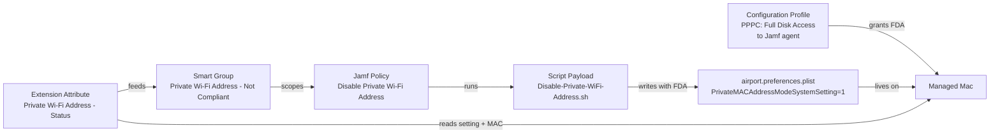
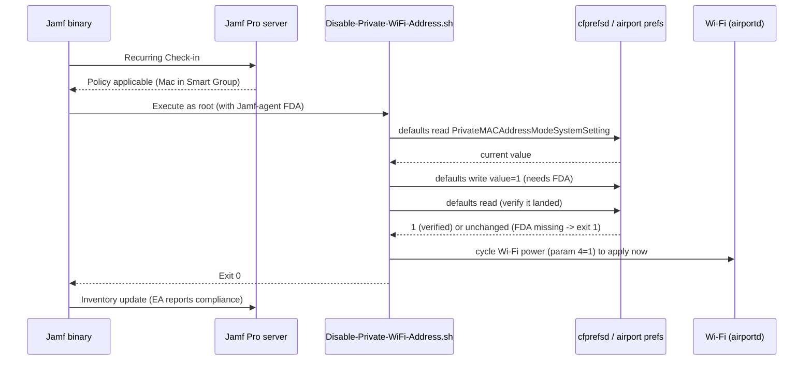

# Disable Private Wi-Fi Address — Deployment Guide

> **ℹ️ Note:** This guide is written for engineers new to MDM. Every
> MDM-specific term is linked to the [Apple Platform Glossary](../../apple-platform-glossary.md)
> on first mention. If a term is unfamiliar, click through before reading on.

**Script:** `Disable-Private-WiFi-Address.sh`
**Version documented:** `2.3`
**Author:** Heath Jones
**Last updated:** `2026-10-04`
**Target platform:** macOS `26+` managed by [Jamf Pro](../../apple-platform-glossary.md#jamf-pro) (the underlying setting also works on macOS 15.6+)

---

## 1. Overview

macOS randomizes the Wi-Fi hardware (MAC) address per network — the "Private Wi-Fi Address" feature. That rotation breaks corporate NAC (Network Access Control) policies that authorize devices by MAC. This deployment disables Private Wi-Fi Address fleet-wide by setting the system-wide `PrivateMACAddressModeSystemSetting` key to `1`, which forces macOS to use the real hardware MAC for **existing and newly-joined** networks. It runs as a recurring [Policy](../../apple-platform-glossary.md#policy) [Script](../../apple-platform-glossary.md#script-payload), reports compliance through an [Extension Attribute](../../apple-platform-glossary.md#extension-attribute-ea), and is targeted by a [Smart Group](../../apple-platform-glossary.md#smart-group).

> **⚠️ Warning:** On macOS 15.6+ and macOS 26, the file this script writes is protected by [TCC](../../apple-platform-glossary.md#tcc). The Jamf agent **must** be granted [Full Disk Access](../../apple-platform-glossary.md#pppc) via a [PPPC](../../apple-platform-glossary.md#pppc) [Configuration Profile](../../apple-platform-glossary.md#configuration-profile) or the write silently fails. This is a hard prerequisite — see Section 4.2.

**What gets deployed:**
- `Disable-Private-WiFi-Address.sh` — Jamf Script payload that asserts `PrivateMACAddressModeSystemSetting=1`, verifies the write, and optionally cycles Wi-Fi to apply immediately.
- `EA-Disable-Private-WiFi-Address-Status.sh` — Extension Attribute reporting the setting value and hardware-vs-live MAC compliance.
- **PPPC Configuration Profile** (prerequisite) — grants Full Disk Access to the Jamf agent so the write is permitted.
- **Smart Group** — scopes the policy to non-compliant Macs.

**What the end user sees:** Nothing — this runs silently. If Wi-Fi restart is enabled (default), the user's Wi-Fi briefly disconnects and reconnects once, when the setting first changes.

**Runs as:** root (Jamf policy context).

**Runs when:** [Recurring Check-in](../../apple-platform-glossary.md#recurring-check-in), execution frequency `Ongoing` — it re-asserts compliance on every check-in while the Mac is in scope.

---

## 2. Architecture

### Component diagram



### Runtime sequence



### How the components relate

The **Smart Group** is the entry point: it holds every Mac whose Extension Attribute reports the private address is still on (or the setting is unset). The **Policy** is scoped to that group and runs the **Script** on [Recurring Check-in](../../apple-platform-glossary.md#recurring-check-in). Because the frequency is `Ongoing`, the Mac re-runs the script on each check-in until it becomes compliant and drops out of the group — the Smart Group, not the policy frequency, bounds execution.

The script's only real action is a single `defaults write` to `/Library/Preferences/SystemConfiguration/com.apple.airport.preferences`. That file is [TCC](../../apple-platform-glossary.md#tcc)-protected on macOS 15.6+/26, so the write only succeeds when the Jamf agent has been granted [Full Disk Access](../../apple-platform-glossary.md#pppc) by the prerequisite **PPPC Configuration Profile**. The script never trusts the `defaults` exit code (it is unreliable for this domain); instead it **reads the value back** and fails loudly (exit `1`) if it did not land — which is the signal that the FDA profile is missing.

The **Extension Attribute** is the source of truth for state. It reads the setting value and compares the live interface MAC (`ifconfig ether`) against the hardware MAC (`networksetup -getmacaddress`). Reads of the airport prefs work without FDA (the file is world-readable), so the EA reports correctly even on Macs where the policy has not yet run. Its output drives Smart Group membership, closing the loop.

Everything runs in root context on the endpoint. There is no on-endpoint file this deployment installs — it modifies an OS-owned preference file in place. There is no LaunchDaemon (an earlier design used one; it was removed once testing proved the single system-wide key covers existing and new networks).

---

## 3. Component Inventory

### On-endpoint files

| Name | Path | Delivery mechanism | Purpose |
|---|---|---|---|
| `com.apple.airport.preferences.plist` | `/Library/Preferences/SystemConfiguration/com.apple.airport.preferences.plist` | **Modified** by the script (OS-owned file, not deployed) | Holds `PrivateMACAddressModeSystemSetting`; setting it to `1` disables the private address by default |

> **ℹ️ Note:** This deployment installs **no files of its own** — no helper scripts, no [LaunchDaemon](../../apple-platform-glossary.md#launchdaemon), no receipts. It only flips one key in an existing OS preference file.

### Jamf Pro objects

| Object type | Name | Purpose | Lives at |
|---|---|---|---|
| [Script](../../apple-platform-glossary.md#script-payload) | `Disable Private Wi-Fi Address` | Main policy script | `Settings → Computer Management → Scripts` |
| [Policy](../../apple-platform-glossary.md#policy) | `Disable Private Wi-Fi Address` | Runs the script on check-in | `Computers → Policies` |
| [Extension Attribute](../../apple-platform-glossary.md#extension-attribute-ea) | `Private Wi-Fi Address - Status` | Reports setting + MAC compliance | `Settings → Computer Management → Extension Attributes` |
| [Smart Group](../../apple-platform-glossary.md#smart-group) | `Private Wi-Fi Address - Not Compliant` | Scopes the policy to Macs needing remediation | `Computers → Smart Computer Groups` |
| [Configuration Profile](../../apple-platform-glossary.md#configuration-profile) | `PPPC - Jamf Agent Full Disk Access` | Grants FDA so the write is permitted (prerequisite) | `Computers → Configuration Profiles` |
| [Category](../../apple-platform-glossary.md#category) | `Security` | Organizes the objects | `Settings → Global → Categories` |

### Script parameters

Jamf passes script parameters as positional arguments `$1–$11`. `$1–$3` are reserved by Jamf for the mount point, computer name, and username. This script uses `$4`.

| Position | Label in Jamf UI | Purpose | Example value | Required |
|---|---|---|---|---|
| `$4` | `Restart Wi-Fi (1=yes / 0=no)` | When the setting changes, cycle Wi-Fi power to apply the hardware MAC immediately (`1`) or leave it for next connect/reboot (`0`) | `1` | No (defaults to `1`) |

### Configuration Profile preference domain (if any)

*Not applicable for the main script* — it reads no managed preferences. The prerequisite PPPC profile is a **Privacy Preferences Policy Control** payload, not a Custom Settings preference domain; see Section 4.2 and 6.5.

---

## 4. Dependencies and Prerequisites

### 4.1 Endpoint binaries

*None required.* The script uses only baseline macOS binaries (`defaults`, `networksetup`, `ifconfig`, `sw_vers`, `pgrep`, `killall`). No `jq`, no swiftDialog.

### 4.2 Prerequisite Jamf Pro objects

These must exist before this Policy is created or the deployment will not work.

- [ ] [Category](../../apple-platform-glossary.md#category) `Security` exists.
- [ ] **[PPPC](../../apple-platform-glossary.md#pppc) [Configuration Profile](../../apple-platform-glossary.md#configuration-profile) granting [Full Disk Access](../../apple-platform-glossary.md#tcc) to the Jamf agent is deployed and scoped to the target Macs.** This is the critical prerequisite — without it the `defaults write` fails.
  - Payload: **Privacy Preferences Policy Control**
  - Identifier: `/usr/local/jamf/bin/jamf` (Identifier Type: `Path`)
  - Code requirement: `identifier "com.jamfsoftware.jamf" and anchor apple generic and certificate leaf[subject.OU] = "483DWKW443"`
  - Service: **System Policy All Files (SystemPolicyAllFiles) → Allow**
- [ ] [Extension Attribute](../../apple-platform-glossary.md#extension-attribute-ea) `Private Wi-Fi Address - Status` created and reporting on at least one test Mac.
- [ ] [Smart Group](../../apple-platform-glossary.md#smart-group) `Private Wi-Fi Address - Not Compliant` created.

> **⚠️ Warning:** Granting Full Disk Access to `/usr/local/jamf/bin/jamf` is a broad, fleet-wide grant — every script Jamf runs inherits full-disk access. This is a deliberate security tradeoff. If that is unacceptable in your environment, the alternative is a Wi-Fi Configuration Profile with `DisableAssociationMACRandomization` scoped per corporate SSID (no FDA needed, but only covers the SSIDs you define). Confirm the org's stance before deploying.

### 4.3 Network reachability

*None required.* The script makes no network calls.

### 4.4 Credentials and secrets

*None required.* The script uses no credentials, API clients, or keychain items.

---

## 5. Pre-Deployment Checklist

Complete every item before moving to Section 6.

- [ ] Script has been reviewed, tested locally, and is the final version (v2.3).
- [ ] `ORG_NAME_FRIENDLY` and `ORG_PLIST_DOMAIN` in the script (lines marked `CHANGE_ME`) have been changed from the `Company Name` / `com.company` defaults to your organization's values (`ORG_PLIST_DOMAIN` drives the log label). The EA has no org-specific values.
- [ ] The PPPC Full Disk Access profile (Section 4.2) is deployed and scoped to your test Mac.
- [ ] A test computer exists in the test Smart Group scoped for this Policy.
- [ ] You have privileges in Jamf Pro to create Scripts, Policies, EAs, Smart Groups, and Configuration Profiles (`Settings → System → Jamf Pro User Accounts & Groups`).
- [ ] You have tested the script locally (see Section 6.1) and confirmed exit code `0` **with the PPPC profile in place**.
- [ ] The [Category](../../apple-platform-glossary.md#category) `Security` exists.
- [ ] The Extension Attribute `Private Wi-Fi Address - Status` has been created and has populated on at least one test computer.

---

## 6. Deployment Procedure

Follow every sub-step in order.

### 6.1 Local testing before uploading to Jamf

Test on a Mac that already has the PPPC Full Disk Access profile applied (otherwise the write will correctly fail).

```bash
# From your admin Mac, with sudo. Jamf passes the Restart Wi-Fi option as $4,
# so pass three placeholder args first: mount point, computer name, username.
sudo /path/to/Disable-Private-WiFi-Address.sh / "" "" 1

# Watch the unified log in a second Terminal tab
log stream --predicate 'eventMessage CONTAINS "disable-private-wifi-address"' --info --debug
```

Expected outcomes:
- Exit code `0`.
- Unified log shows `[INFO] Disable-Private-WiFi-Address.sh v2.3 starting` and `[INFO] Disable-Private-WiFi-Address.sh completed successfully`.
- Log shows `[INFO] Verified PrivateMACAddressModeSystemSetting=1`.
- After the Wi-Fi reconnect, log shows `[INFO] COMPLIANT: interface is using the hardware MAC (private address off)`.
- Verify directly:
  ```bash
  defaults read /Library/Preferences/SystemConfiguration/com.apple.airport.preferences PrivateMACAddressModeSystemSetting   # -> 1
  # These two should now MATCH:
  networksetup -getmacaddress en0 | awk '{print $3}'   # hardware MAC
  ifconfig en0 | awk '/ether/{print $2}'               # live MAC
  ```

> **⚠️ Warning:** If the log shows `[ERROR] Write did NOT take ... the Jamf agent needs Full Disk Access (PPPC)` and exit code `1`, the PPPC profile is missing or not yet applied to this Mac. Fix that before proceeding — do not upload assuming it will work under Jamf.

### 6.2 Create the [Script payload](../../apple-platform-glossary.md#script-payload) in Jamf Pro

1. In Jamf Pro, go to **Settings → Computer Management → Scripts**.
2. Click **+ New** in the top-right.
3. **General** tab:
   - **Display Name:** `Disable Private Wi-Fi Address`
   - **Category:** `Security`
   - **Notes:** Brief description — include a link to this guide.
4. **Script** tab: paste the entire contents of `Disable-Private-WiFi-Address.sh`, including the shebang and Script Information Block banners.
5. **Options** tab:
   - **Priority:** `After`.
   - **Parameter Label 4:** `Restart Wi-Fi (1=yes / 0=no)`.
6. **Limitations** tab: leave at defaults (the script self-gates macOS version).
7. Click **Save**.

### 6.3 Create the [Extension Attribute](../../apple-platform-glossary.md#extension-attribute-ea)

1. Go to **Settings → Computer Management → Extension Attributes**.
2. Click **+ New**.
3. **Display Name:** `Private Wi-Fi Address - Status`
4. **Description:** Reports `SysDefault=off|on|unset | MAC=hardware|randomized`.
5. **Data Type:** `String`
6. **Input Type:** `Script`
7. Paste the contents of `EA-Disable-Private-WiFi-Address-Status.sh`.
8. Click **Save**.
9. Trigger an [Inventory Update](../../apple-platform-glossary.md#inventory-update-recon) on your test Mac: `sudo jamf recon`. Verify the EA populates at `Computers → Search Inventory → <test computer> → Extension Attributes`.

### 6.4 Create the [Smart Group](../../apple-platform-glossary.md#smart-group) that scopes the Policy

1. Go to **Computers → Smart Computer Groups → + New**.
2. **Display Name:** `Private Wi-Fi Address - Not Compliant`
3. **Criteria** tab: add criteria matching non-compliant Macs:
   - `Operating System Version` `like` `26.` (matches your macOS 26 target)
   - `and` `Private Wi-Fi Address - Status` `like` `MAC=randomized`
   - `or` `Private Wi-Fi Address - Status` `like` `SysDefault=on`
   - `or` `Private Wi-Fi Address - Status` `like` `SysDefault=unset`
4. Click **Save**. Membership populates over the next few minutes as inventories update.

> **✅ Tip:** Targeting on `MAC=randomized` keeps a Mac in scope until the hardware MAC is actually in use — not merely until the key is set — so a Mac that set the key but hasn't reconnected yet stays in scope and gets the reconnect on the next run.

### 6.5 Create the [Configuration Profile](../../apple-platform-glossary.md#configuration-profile) (PPPC — prerequisite)

This is the Full Disk Access grant. It is a prerequisite, so create and deploy it **before** the policy.

1. Go to **Computers → Configuration Profiles → + New**.
2. **General** payload:
   - **Name:** `PPPC - Jamf Agent Full Disk Access`
   - **Category:** `Security`
   - **Distribution Method:** `Install Automatically`
   - **Level:** `Computer Level`
3. **Privacy Preferences Policy Control** payload → **+ Add**:
   - **Identifier:** `/usr/local/jamf/bin/jamf`
   - **Identifier Type:** `Path`
   - **Code Requirement:** `identifier "com.jamfsoftware.jamf" and anchor apple generic and certificate leaf[subject.OU] = "483DWKW443"`
   - **App or Service:** `SystemPolicyAllFiles` → **Access:** `Allow`
4. **Scope** tab: target the same population as the policy (or all managed Macs).
5. Click **Save** and deploy.

> **ℹ️ Note:** PPPC profiles can only be delivered by MDM — they cannot be granted by a script or by the end user for a background daemon. This is why the Jamf-agent FDA grant is mandatory rather than something the script can self-provision.

### 6.6 Create the [Policy](../../apple-platform-glossary.md#policy)

1. Go to **Computers → Policies → + New**.
2. **General** payload:
   - **Display Name:** `Disable Private Wi-Fi Address`
   - **Enabled:** checked
   - **Category:** `Security`
   - **Trigger:** check **Recurring Check-in**.
   - **Execution Frequency:** `Ongoing`.
3. **Scripts** payload → **Configure → Add** the script created in 6.2:
   - Set **Priority** to `After`.
   - **Restart Wi-Fi (1=yes / 0=no):** `1`.
4. **Scope** tab:
   - **Targets** → **+ Add** → **Computer Groups** → select `Private Wi-Fi Address - Not Compliant`.
   - **Exclusions** → add your admin test fleet during initial rollout, then remove once validated.
5. Click **Save**.

### 6.7 Self Service variant (optional)

*Not applicable — this deployment runs silently via the check-in trigger only.*

### 6.8 Ongoing-trigger variant

This deployment **is** the ongoing variant:

- **Trigger:** `Recurring Check-in`
- **Execution Frequency:** `Ongoing`
- Smart Group membership bounds execution: the policy runs on each check-in only while the Mac reports non-compliant. Once compliant, the Mac leaves the group and the policy stops running on it.

---

## 7. Validation / Smoke Test

After deploying to the test Smart Group, verify on at least one test Mac (with the PPPC profile applied).

### On the test Mac

```bash
# Force a check-in
sudo jamf policy

# Inspect the Jamf policy log
sudo tail -50 /var/log/jamf.log

# Inspect the script's unified log output
log show --predicate 'eventMessage CONTAINS "disable-private-wifi-address"' --info --last 10m
```

**Expected:**
- `/var/log/jamf.log` shows `Executing Policy Disable Private Wi-Fi Address` and `Script exit code: 0`.
- `defaults read /Library/Preferences/SystemConfiguration/com.apple.airport.preferences PrivateMACAddressModeSystemSetting` returns `1`.
- Live MAC equals hardware MAC:
  ```bash
  test "$(ifconfig en0 | awk '/ether/{print $2}')" = "$(networksetup -getmacaddress en0 | awk '{print $3}')" && echo "COMPLIANT" || echo "still randomized"
  ```

### In Jamf Pro

1. Go to **Computers → Search Inventory → `<test computer>`**.
2. Open the **History** tab → **Policy Logs**.
3. Find the most recent `Disable Private Wi-Fi Address` run and click **View Log**. Confirm success.
4. Trigger an Inventory Update (`sudo jamf recon`) and verify the [Extension Attribute](../../apple-platform-glossary.md#extension-attribute-ea) `Private Wi-Fi Address - Status` reads `SysDefault=off | MAC=hardware`.
5. Confirm the Mac drops out of the `Private Wi-Fi Address - Not Compliant` Smart Group.

---

## 8. Troubleshooting

### 8.1 Exit code reference

| Exit code | Meaning | Recommended action |
|---|---|---|
| `0` | Success — setting is `1` (verified), or Mac is already compliant, or macOS < 15 (not applicable) | No action needed |
| `1` | Not running as root, **or** the write did not take (read-back mismatch) — almost always the **PPPC Full Disk Access profile is missing/not applied** | Confirm the PPPC profile from Section 4.2/6.5 is deployed and scoped to the Mac; re-run |

> **ℹ️ Note:** The exit code is a hint; the unified log is the truth. The script logs the exact reason (`Write did NOT take ... needs Full Disk Access`) before exiting `1`.

### 8.2 Unified log predicates

All script logs use the label `<ORG_PLIST_DOMAIN>.disable-private-wifi-address` via `logger`; filtering on the stable `disable-private-wifi-address` fragment works regardless of your org domain.

**Normal operation (last hour):**
```bash
log show --predicate 'eventMessage CONTAINS "disable-private-wifi-address"' --info --last 1h
```

**Errors only:**
```bash
log show --predicate 'eventMessage CONTAINS "disable-private-wifi-address" AND messageType == error' --last 24h
```

**Live tail (during test runs):**
```bash
log stream --predicate 'eventMessage CONTAINS "disable-private-wifi-address"' --info --debug
```

**TCC denials (the useful one when the write fails):**
```bash
log show --predicate 'subsystem == "com.apple.TCC" AND eventMessage CONTAINS "denied"' --last 1h
```

### 8.3 Policy log locations

| Location | Use when |
|---|---|
| `/var/log/jamf.log` on the endpoint | Tailing live policy execution or post-mortem on a single Mac |
| `Computers → <record> → History → Policy Logs` in Jamf Pro | Reviewing across the fleet or on a Mac you don't have hands-on access to |
| `log show --predicate 'eventMessage CONTAINS "disable-private-wifi-address"'` | Reading what the script itself logged to the [unified log](../../apple-platform-glossary.md#unified-log) |

### 8.4 Common failure modes

#### Symptom: script exits `1` — "Write did NOT take" / write fails only under Jamf

| Root cause | Diagnostic | Resolution |
|---|---|---|
| [PPPC/TCC](../../apple-platform-glossary.md#tcc) Full Disk Access not granted to the Jamf agent | `log show --predicate 'subsystem == "com.apple.TCC" AND eventMessage CONTAINS "denied"' --last 10m` shows a denial referencing `jamf`; `defaults read ... PrivateMACAddressModeSystemSetting` still shows old value after a run | Deploy/scope the PPPC profile from Section 6.5. Confirm applied: `sudo profiles list -type configuration \| grep -i pppc`. An interactive `sudo` in Terminal may succeed (Terminal/SSH has its own FDA) while Jamf fails — always test via `sudo jamf policy`, not just a manual run. |

#### Symptom: script runs manually but fails under Jamf policy

| Root cause | Diagnostic | Resolution |
|---|---|---|
| `PATH` not exported — binary resolution fails under Jamf's execution environment | Jamf policy log shows `command not found` | The script exports `PATH` near the top; confirm you pasted the whole script including the Core Defined Variables block. |
| Interactive context has FDA that Jamf lacks | Manual `sudo` write works, Jamf write fails | This is the PPPC issue above — the manual success is misleading. Grant FDA to the Jamf agent. |

#### Symptom: setting is `1` but the MAC is still randomized

| Root cause | Diagnostic | Resolution |
|---|---|---|
| Wi-Fi hasn't reassociated since the setting changed | `ifconfig en0 ether` differs from `networksetup -getmacaddress en0`; EA reads `SysDefault=off | MAC=randomized` | Run with param 4 = `1` (default) to cycle Wi-Fi, or the Mac will pick it up on next reconnect/reboot. The Smart Group targets `MAC=randomized`, so it stays in scope and self-heals on the next check-in. |
| A specific SSID has an explicit per-network "Rotating" setting | That one network keeps rotating despite the system default | The system default only covers networks without an explicit per-SSID setting. For a corporate SSID, pair this with a Wi-Fi Configuration Profile (`DisableAssociationMACRandomization`) for that SSID. |

#### Symptom: policy never runs on the target Mac

| Root cause | Diagnostic | Resolution |
|---|---|---|
| Mac not in [Smart Group](../../apple-platform-glossary.md#smart-group) scope | `Computers → <record> → Smart/Static Computer Groups` shows the group absent | Confirm the EA has reported (`Computers → <record> → Extension Attributes`); run `sudo jamf recon`; wait 1–5 minutes for recalculation. |
| Extension Attribute hasn't reported yet | EA value blank in inventory | Run `sudo jamf recon`; if still blank, run the EA script standalone to confirm it outputs `<result>…</result>`. |
| Policy disabled | Policy `General` tab shows **Enabled** unchecked | Re-enable. |

#### Symptom: script fails specifically on Apple Silicon or FileVault-enabled Mac

| Root cause | Diagnostic | Resolution |
|---|---|---|
| [FileVault](../../apple-platform-glossary.md#filevault) pre-login state on a `Startup` trigger | N/A here — this policy uses Recurring Check-in, not Startup | No action; the trigger choice already avoids this. |
| [Apple Silicon](../../apple-platform-glossary.md#apple-silicon) differences | None — the script uses no architecture-specific binaries | No action. |

### 8.5 Validation one-liners

```bash
# What is the setting right now?
defaults read /Library/Preferences/SystemConfiguration/com.apple.airport.preferences PrivateMACAddressModeSystemSetting

# Is the interface using the hardware MAC?
test "$(ifconfig en0 | awk '/ether/{print $2}')" = "$(networksetup -getmacaddress en0 | awk '{print $3}')" && echo "COMPLIANT" || echo "randomized"

# Is the PPPC Full Disk Access profile installed?
sudo profiles list -type configuration | grep -i pppc

# What does the EA report?
sudo /path/to/EA-Disable-Private-WiFi-Address-Status.sh

# Latest script log entries
log show --predicate 'eventMessage CONTAINS "disable-private-wifi-address"' --info --last 30m | tail -50
```

---

## 9. Rollback and Uninstall

To cleanly remove this deployment, perform every step below. Order matters.

### 9.1 Stop execution

1. In Jamf Pro, disable the Policy (`Computers → Policies → Disable Private Wi-Fi Address → General → Enabled` → uncheck → **Save**).

### 9.2 Revert the setting on endpoints (optional)

This deployment installs no files, so there is nothing to delete. If you want to **re-enable** MAC randomization (revert the change), deploy a one-off policy or run manually with `sudo` (requires the Jamf-agent FDA profile to still be present):

```bash
#!/bin/bash
set -euo pipefail

# Set the default back to ON (randomize), or use `delete` to remove the key entirely.
defaults write /Library/Preferences/SystemConfiguration/com.apple.airport.preferences PrivateMACAddressModeSystemSetting -int 0
# Cycle Wi-Fi so it takes effect
WIFI=$(networksetup -listallhardwareports | awk '/Hardware Port: Wi-Fi/{getline; print $2; exit}')
networksetup -setairportpower "${WIFI:-en0}" off
sleep 1
networksetup -setairportpower "${WIFI:-en0}" on
```

> **⚠️ Warning:** Reverting re-enables MAC randomization and will break MAC-based NAC again. Only do this if you are decommissioning the whole solution.

### 9.3 Remove Jamf Pro objects

Delete in this order to avoid orphan references:

1. The Policy `Disable Private Wi-Fi Address`.
2. The Script payload `Disable Private Wi-Fi Address`.
3. The Extension Attribute `Private Wi-Fi Address - Status`.
4. The Smart Group `Private Wi-Fi Address - Not Compliant` (only if not referenced elsewhere).
5. The PPPC Configuration Profile `PPPC - Jamf Agent Full Disk Access` — **only if no other workflow depends on Jamf-agent Full Disk Access.** Many other scripts may rely on it; check before removing.

### 9.4 Force reporting update

Trigger `sudo jamf recon` on affected Macs so Smart Group membership and EA values refresh in Jamf Pro.

---

## 10. Change Log

| Version | Date | Author | Change |
|---|---|---|---|
| 1.0 | 2026-07-09 | Heath Jones | Initial release — self-installing LaunchDaemon + WatchPaths watcher + per-SSID enforcement. |
| 2.0 | 2026-07-09 | Heath Jones | Rearchitected to a simple Jamf policy script after testing showed the single system-wide key covers existing + new networks, and that the blocker was TCC/Full Disk Access, not an Apple removal. Dropped the daemon and known-networks enumeration. |
| 2.1 | 2026-07-09 | Heath Jones | Renamed deployable to `disable-private-wifi-address.sh` (no longer an installer). |
| 2.2 | 2026-10-04 | Heath Jones | Public release prep: sanitized identifiers, expert-bash conformance (Requirements + preflight, param 4 validation). EA 2.1 fixes its result wrapper to `<result></result>` so Jamf parses the value. |
| 2.3 | 2026-10-04 | Heath Jones | Renamed to the Name-Of-Script.sh convention (`Disable-Private-WiFi-Address.sh`, `EA-Disable-Private-WiFi-Address-Status.sh`). |

---

**Related documentation:**
- [Apple Platform Glossary](../../apple-platform-glossary.md)
- Tech support guide: `Disable-Private-WiFi-Address-Tech-Guide.md`
- Source: `Disable-Private-WiFi-Address/` in this repository
