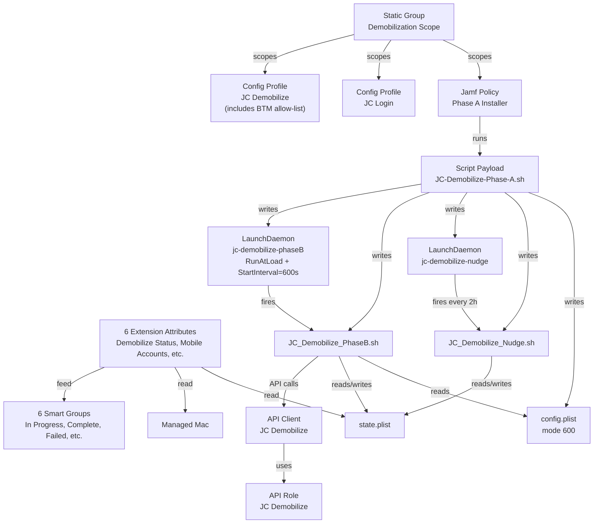
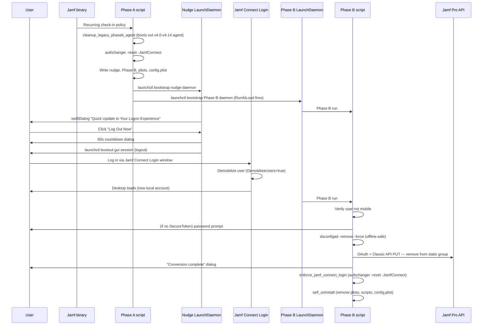

# Jamf Connect Demobilization — Deployment Guide

> **ℹ️ Note:** This guide is written for engineers new to MDM. Every
> MDM-specific term is linked to the [Apple Platform Glossary](../../apple-platform-glossary.md)
> on first mention. If a term is unfamiliar, click through before reading on.

**Script:** `JC-Demobilize-Phase-A.sh`
**Version documented:** `4.20` (Phase A) / `2.14` (Phase B) / `1.8` (nudge)
**Author:** Heath Jones
**Last updated:** `2026-10-04`
**Target platform:** macOS `13+` managed by [Jamf Pro](../../apple-platform-glossary.md#jamf-pro)

---

## 1. Overview

This deployment converts users from **mobile [Active Directory](../../apple-platform-glossary.md#active-directory) accounts** into plain **local accounts** on managed Macs, then unbinds each Mac from AD. It runs in two phases. Phase A is a [Jamf Pro Policy](../../apple-platform-glossary.md#policy) that lays down a recurring user nudge (asking users to log out so Jamf Connect Login can demobilize their accounts during their next login) plus everything needed for Phase B. Phase B is a [LaunchDaemon](../../apple-platform-glossary.md#launchdaemon)-driven finalization script deployed by Phase A; it fires at install time and again every 10 minutes, verifies the user is now local, grants a [SecureToken](../../apple-platform-glossary.md#secure-token) if needed, unbinds AD, and removes the Mac from a tracking [Static Group](../../apple-platform-glossary.md#static-group) via the [Jamf Pro API](../../apple-platform-glossary.md#jamf-pro-api). Six [Extension Attributes](../../apple-platform-glossary.md#extension-attribute-ea) report per-Mac progress so admins can monitor the rollout from [Smart Group](../../apple-platform-glossary.md#smart-group) dashboards.

**What gets deployed:**

- `JC-Demobilize-Phase-A.sh` — Jamf Script payload; one-shot installer that writes everything below
- `JC_Demobilize_Nudge.sh` — recurring user prompt (only when mobile users exist on the Mac)
- `JC_Demobilize_PhaseB.sh` — daemon-fired finalization script
- `config.plist` — credentials Phase B needs at runtime (mode `600 root:wheel`)
- `state.plist` — workflow progress receipt (read by EAs and Phase B)
- Three [Configuration Profiles](../../apple-platform-glossary.md#configuration-profile) (Jamf Connect Login + JC Demobilize + Service Management Managed Login Items allow-list)
- Two [LaunchDaemon](../../apple-platform-glossary.md#launchdaemon) plists (nudge daemon, Phase B daemon)
- Six [Extension Attributes](../../apple-platform-glossary.md#extension-attribute-ea) reporting workflow state
- One [Static Group](../../apple-platform-glossary.md#static-group) (the rollout cohort)
- Six [Smart Groups](../../apple-platform-glossary.md#smart-group) (monitoring dashboards)
- One [API Role](../../apple-platform-glossary.md#api-role) + [API Client](../../apple-platform-glossary.md#api-client) for Phase B

**What the end user sees:** A friendly [swiftDialog](../../apple-platform-glossary.md#swiftdialog) prompt every two hours asking them to save work and log out, with a 60-second logout countdown after they confirm. After they log back in, an optional password prompt if their account needs a SecureToken granted, then a "conversion complete" confirmation dialog.

**Org identity and paths:** Every path and label in this guide uses the script defaults, `ORG_NAME_FRIENDLY="Company Name"` (so the path-safe `ORG_NAME` is `CompanyName`) and `ORG_PLIST_DOMAIN="com.company"`. Set both in Phase A before upload (Section 6.2), then substitute your values wherever this guide shows `CompanyName` or `com.company`.

**Runs as:** Phase A as `root` (Jamf Policy). Nudge as `root` with [`launchctl asuser`](../../apple-platform-glossary.md#launchctl) for the user-facing dialog. Phase B as `root`.

**Runs when:** Phase A on [Recurring Check-in](../../apple-platform-glossary.md#recurring-check-in). Nudge every 7200 seconds (2h, configurable via Phase A parameter `$4`). Phase B fires at install time (`RunAtLoad`) and every 600 seconds thereafter (`StartInterval`) until it self-uninstalls.

---

## 2. Architecture

### Component diagram



### Runtime sequence



### How the components relate

The **Phase A Jamf Policy** is the only thing scheduled in Jamf Pro. It runs once per check-in for any Mac in the Demobilization Scope [Static Group](../../apple-platform-glossary.md#static-group). On each run, Phase A is idempotent — it overwrites the deployed scripts and reloads the daemons, so re-runs are harmless.

Phase A's job is bootstrap, not interaction. Before deploying anything, it confirms [Jamf Connect Login](../../apple-platform-glossary.md#jamf-connect) is installed (looking for `/usr/local/bin/authchanger`) — and if it isn't, it falls back to triggering a separate install policy via `jamf policy -event <trigger>` (the trigger name is supplied as parameter `$10`). Once JC Login is present, Phase A runs `authchanger -reset -JamfConnect` so the JC Login window replaces the macOS login window and JC Login takes over authentication (with `DemobilizeUsers=true` from the config profile, JC Login demobilizes the user during their next login). The reset is a single call — chaining a follow-up `-reset -preAuth JamfConnectLogin:DeMobilize,privileged` would destroy the JC Login chain because `-reset` is destructive (this was an actual bug in v4.9–v4.15 that left Macs on the macOS login window after demobilization; fixed in v4.16). Phase A then writes a credentials [`config.plist`](../../apple-platform-glossary.md#preference-domain) (mode `600 root:wheel`) holding the [API Client](../../apple-platform-glossary.md#api-client) credentials and the local SecureToken admin account, writes Phase B and its [LaunchDaemon](../../apple-platform-glossary.md#launchdaemon), and — if the Mac has any mobile accounts — also writes the recurring nudge and its LaunchDaemon. After Phase A exits, the Mac is fully self-driving — Jamf isn't needed again until Phase B's API call near the end.

Phase A also runs `cleanup_legacy_phaseb_agent` early in main: it boots out the v4.0–v4.14 trigger LaunchAgent (`com.company.jc-demobilize-phaseB-trigger`) from every active GUI session, removes the agent plist from `/Library/LaunchAgents/`, and clears legacy sentinel files at both `/tmp/jc-demobilize-phaseB.trigger` and `/var/run/jc-demobilize-phaseB.trigger`. This is what suppresses the macOS BTM "touch can run in the background" notification on Macs upgraded from any prior build — without it, the orphan agent kept firing `touch` at every login. Idempotent, so safe on a fresh Mac too.

**Phase B fires itself on a clock, not a login event.** The Phase B LaunchDaemon uses `RunAtLoad=true` (so it fires once when Phase A bootstraps it) plus `StartInterval=600` (so it fires every 10 minutes thereafter). On each fire, Phase B grabs an mkdir-based mutex, checks whether the user is still mobile / the Mac is still bound / the static group still lists the Mac, and either runs the appropriate finalization step or exits cleanly to retry on the next interval. When the workflow completes, Phase B self-uninstalls (removes its script, its daemon plist, `config.plist`, and boots itself out of launchd). Worst-case latency between a successful demobilizing login and Phase B finishing the workflow is `PHASEB_RETRY_INTERVAL` seconds (default 600).

The AD unbind step inside Phase B is **local-only**: it uses `dsconfigad -remove -force` and never contacts a domain controller, so neither the Mac nor the workflow needs network reachability to AD at any point. A separate AD computer-object cleanup process handles stale records.

The static-group removal uses the **Jamf Pro Classic API** (`PUT /JSSResource/computergroups/id/<id>` with an XML `<computer_deletions>` body). The modern v1 endpoint (`PATCH /api/v1/static-computer-groups/<id>`) does not exist on Jamf Pro 11.26.x and was returning 404 — fixed in v4.14 / Phase B v2.9. Both APIs accept the same OAuth bearer token, so no additional credentials are required.

**State is communicated through `state.plist`** at `/Library/Application Support/CompanyName/JCDemobilize/state.plist`. The nudge writes the receipt the first time it prompts a mobile user (`phase=A_complete`). Phase B reads the receipt to gate execution and updates `status` as it progresses (`In Progress` → `Complete` or `Failed`). The `EA-Demobilization-Status` Extension Attribute reads this same plist and reports state up to Jamf for [Smart Group](../../apple-platform-glossary.md#smart-group)-driven dashboards.

**Root vs. user context boundary:** Everything runs as root. The nudge and Phase B both use [`launchctl asuser`](../../apple-platform-glossary.md#launchctl) to render swiftDialog in the console user's GUI session — root forks the dialog process, but only user context can render to the screen. There is no user-context LaunchAgent in this deployment as of v4.15: the previous LaunchAgent + sentinel-file trigger was removed because its `/usr/bin/touch` invocation surfaced a macOS [Background Task Management](../../apple-platform-glossary.md#background-task-management-btm) "touch can run in the background" notification on every install, and the daemon's `StartInterval` covers the same wake-up case.

**BTM allow-listing.** macOS Ventura+ surfaces a user-facing notification when any LaunchDaemon or LaunchAgent is first registered, unless the item is allow-listed via a Configuration Profile with the `com.apple.servicemanagement.managed` payload. The JC Demobilize Configuration Profile carries that payload, listing every label under `com.company.jc-demobilize` (a `LabelPrefix` rule). Because the profile is scoped to the same Static Group as Phase A, when Phase B self-uninstalls and the Mac falls out of scope, the allow-listing leaves with the profile — no orphan rules, no manual cleanup.

---

## 3. Component Inventory

### On-endpoint files

| Name | Path | Delivery mechanism | Purpose |
|---|---|---|---|
| `JC-Demobilize-Phase-A.sh` | (Not deployed to disk) | [Jamf Script payload](../../apple-platform-glossary.md#script-payload), executed in `/tmp` by `jamf` binary | One-shot installer; writes all other artifacts |
| `JC_Demobilize_Nudge.sh` | `/Library/Application Support/CompanyName/JCDemobilize/JC_Demobilize_Nudge.sh` | Written by Phase A via heredoc (only when mobile accounts exist) | Recurring user prompt to log out and back in |
| `JC_Demobilize_PhaseB.sh` | `/Library/Application Support/CompanyName/JCDemobilize/JC_Demobilize_PhaseB.sh` | Written by Phase A via heredoc | Conversion finalization script |
| `config.plist` | `/Library/Application Support/CompanyName/JCDemobilize/config.plist` | Written by Phase A | Credentials Phase B reads at runtime; mode `600 root:wheel` |
| `state.plist` | `/Library/Application Support/CompanyName/JCDemobilize/state.plist` | Written by nudge or Phase A; updated by Phase B | Workflow progress receipt; read by EAs |
| Nudge LaunchDaemon | `/Library/LaunchDaemons/com.company.jc-demobilize-nudge.plist` | Written by Phase A | Fires nudge on `StartInterval` (default 7200s) |
| Phase B LaunchDaemon | `/Library/LaunchDaemons/com.company.jc-demobilize-phaseB.plist` | Written by Phase A | `RunAtLoad` once at install, then `StartInterval=600s` until Phase B self-uninstalls |
| Primary log | `/Library/Logs/CompanyName/jc-demobilize.log` | Written by all three scripts | Human-readable timeline |
| Nudge stdout | `/Library/Logs/CompanyName/jc-demobilize-nudge.stdout.log` | Written by launchd | Every log line from each nudge tick |
| Nudge stderr | `/Library/Logs/CompanyName/jc-demobilize-nudge.stderr.log` | Written by launchd | Unexpected shell errors only |
| Phase B stdout | `/Library/Logs/CompanyName/jc-demobilize-phaseB.stdout.log` | Written by launchd | Every log line from each Phase B run |
| Phase B stderr | `/Library/Logs/CompanyName/jc-demobilize-phaseB.stderr.log` | Written by launchd | Unexpected shell errors only |
| Jamf log | `/var/log/jamf.log` | Written by all three scripts (tee) as of v4.18 | Same lines as the primary log, interleaved with Jamf activity |

On **successful** completion, Phase B removes everything except `state.plist`, the log files, and the deploy directory itself.

### Jamf Pro objects

| Object type | Name | Purpose | Lives at |
|---|---|---|---|
| [Script](../../apple-platform-glossary.md#script-payload) | `JC Demobilize — Phase A Installer` | The Phase A installer payload | `Settings → Computer Management → Scripts` |
| [Policy](../../apple-platform-glossary.md#policy) | `JC Demobilize — Phase A Installer` | Runs Phase A on Macs in scope | `Computers → Policies` |
| [Static Group](../../apple-platform-glossary.md#static-group) | `Demobilization Scope` | The rollout cohort; Phase B removes Macs from this group on completion | `Computers → Static Computer Groups` |
| [Smart Group](../../apple-platform-glossary.md#smart-group) | `Demobilize: In Progress` | Monitoring dashboard | `Computers → Smart Computer Groups` |
| [Smart Group](../../apple-platform-glossary.md#smart-group) | `Demobilize: Complete` | Monitoring dashboard | `Computers → Smart Computer Groups` |
| [Smart Group](../../apple-platform-glossary.md#smart-group) | `Demobilize: Failed` | Monitoring dashboard | `Computers → Smart Computer Groups` |
| [Smart Group](../../apple-platform-glossary.md#smart-group) | `Demobilize: Still Mobile` | Monitoring dashboard | `Computers → Smart Computer Groups` |
| [Smart Group](../../apple-platform-glossary.md#smart-group) | `Demobilize: Still AD Bound` | Monitoring dashboard | `Computers → Smart Computer Groups` |
| [Smart Group](../../apple-platform-glossary.md#smart-group) | `Demobilize: Missing PLIST` | Monitoring dashboard | `Computers → Smart Computer Groups` |
| [Extension Attribute](../../apple-platform-glossary.md#extension-attribute-ea) | `EA-JC-Demobilize-PLIST-Installed` | Detects the Demobilize managed pref | `Settings → Computer Management → Extension Attributes` |
| [Extension Attribute](../../apple-platform-glossary.md#extension-attribute-ea) | `EA-JC-Login-PLIST-Installed` | Detects the JC Login profile | `Settings → Computer Management → Extension Attributes` |
| [Extension Attribute](../../apple-platform-glossary.md#extension-attribute-ea) | `EA-Mobile-Accounts-Present` | Lists remaining mobile accounts on the Mac | `Settings → Computer Management → Extension Attributes` |
| [Extension Attribute](../../apple-platform-glossary.md#extension-attribute-ea) | `EA-AD-Bind-Status` | Reports `Bound: <domain>` or `Not Bound` | `Settings → Computer Management → Extension Attributes` |
| [Extension Attribute](../../apple-platform-glossary.md#extension-attribute-ea) | `EA-SecureToken-Holders` | Lists local users holding a SecureToken | `Settings → Computer Management → Extension Attributes` |
| [Extension Attribute](../../apple-platform-glossary.md#extension-attribute-ea) | `EA-Demobilization-Status` | Workflow state: N/A / Not Started / In Progress / Complete / Failed | `Settings → Computer Management → Extension Attributes` |
| [Configuration Profile](../../apple-platform-glossary.md#configuration-profile) | `Jamf Connect Login` | Replaces the macOS login window | `Computers → Configuration Profiles` |
| [Configuration Profile](../../apple-platform-glossary.md#configuration-profile) | `Jamf Connect Login — Demobilize` | Sets `DemobilizeUsers = true`; also carries the BTM allow-list payload for the Phase B and nudge LaunchDaemons | `Computers → Configuration Profiles` |
| [API Role](../../apple-platform-glossary.md#api-role) | `JC Demobilize Role` | Privileges for Phase B's API call | `Settings → System → API roles and clients` |
| [API Client](../../apple-platform-glossary.md#api-client) | `JC Demobilize Client` | OAuth credentials Phase B uses | `Settings → System → API roles and clients` |
| [Category](../../apple-platform-glossary.md#category) | `Identity` | Organizes the policy and config profiles | `Settings → Global → Categories` |

### Script parameters

Phase A is the only script with parameters. All eight slots `$4`–`$11` are used.

| Position | Label in Jamf UI | Purpose | Example value | Required |
|---|---|---|---|---|
| `$4` | `Nudge interval (seconds)` | LaunchDaemon `StartInterval` for the nudge | `7200` (2h default; `300` for piloting) | No (defaults to 7200) |
| `$5` | `Jamf OAuth Client ID` | API Client identifier | UUID string | Yes |
| `$6` | `Jamf OAuth Client Secret` | API Client secret | Generated once on client creation | Yes |
| `$7` | `SecureToken Admin Username` | Local admin account that holds a SecureToken on every target Mac | `localadmin` | Yes |
| `$8` | `SecureToken Admin Password` | Password for the local SecureToken admin | Vault-stored secret | Yes |
| `$9` | `Demobilization Static Group ID` | Numeric Jamf ID of the Demobilization Scope static group | `123` | Yes |
| `$10` | `JC Login Install Trigger` | Custom event name of the policy that installs Jamf Connect Login. Used only as a fallback if JC Login isn't already present when Phase A runs. | `install-jamf-connect-login` | No (recommended) |
| `$11` | `Force-logout threshold (days)` | After this many days of unsuccessful nudges, the workflow replaces the friendly dialog with a 5-minute force-logout warning and forces logout regardless of user input. The friendly dialog also surfaces a "you have N days remaining" notice while the threshold is in effect. `0` disables enforcement entirely. | `7` (production), `14` (lenient), `0` (disabled) | No (defaults to 0) |

> **ℹ️ Note:** AD binding account credentials (formerly `$7`/`$8`) were removed in v4.2. The unbind uses `dsconfigad -remove -force`, which is local-only and never contacts a DC, so binding creds were dead weight. A separate process cleans up stale AD computer objects.

### Configuration Profile preference domain

**Preference domain:** `com.jamf.connect.login`
**Delivered via:** `Computers → Configuration Profiles → Jamf Connect Login → Application & Custom Settings` and `Computers → Configuration Profiles → Jamf Connect Login — Demobilize → Application & Custom Settings`

| Key | Type | Default | Purpose |
|---|---|---|---|
| `DemobilizeUsers` | `Bool` | `true` | When `true`, JC Login converts the authenticating user from mobile to local during their login |
| `<other JC Login keys>` | various | — | JC Login window appearance, IdP endpoints, password policy. Set per your JC Login deployment. |

Read the demobilize key inside scripts with:

```bash
defaults read "/Library/Managed Preferences/com.jamf.connect.login.plist" DemobilizeUsers
```

---

## 4. Dependencies and Prerequisites

### 4.1 Endpoint binaries

| Binary | Required version | Install mechanism | Detection command |
|---|---|---|---|
| `swiftDialog` | `2.5+` | Separate Jamf policy `Install SwiftDialog` (run before Phase A) | `/usr/local/bin/dialog --version` |
| `jq` | `1.6+` | Ships with macOS 15+ at `/usr/bin/jq`; on older macOS deploy it via a pkg policy | `which jq && jq --version` |
| Jamf Connect Login | latest stable | Jamf policy `Install Jamf Connect Login` | `pkgutil --pkg-info com.jamf.connect.login` |

### 4.2 Prerequisite Jamf Pro objects

These must exist before this Policy is created or the deployment will fail.

- [ ] [Category](../../apple-platform-glossary.md#category) `Identity` exists
- [ ] [Configuration Profile](../../apple-platform-glossary.md#configuration-profile) `Jamf Connect Login` is created and scoped to the `Demobilization Scope` static group
- [ ] [Configuration Profile](../../apple-platform-glossary.md#configuration-profile) `Jamf Connect Login — Demobilize` is created and scoped to the same group, carrying **two** payloads: an `Application & Custom Settings` payload setting `DemobilizeUsers = true` under preference domain `com.jamf.connect.login`, AND a `Service Management — Managed Login Items` payload allow-listing both LaunchDaemons under the `LabelPrefix` rule `com.company.jc-demobilize` (suppresses the macOS BTM "can run in the background" notification)
- [ ] [Static Group](../../apple-platform-glossary.md#static-group) `Demobilization Scope` is created (members added during rollout)
- [ ] All six Extension Attributes (Section 3 above) are created and have populated on at least one test computer
- [ ] [API Role](../../apple-platform-glossary.md#api-role) `JC Demobilize Role` exists with privileges: `Read Computers`, `Read Computer Inventory Collection`, `Read Static Computer Groups`, `Update Static Computer Groups`
- [ ] [API Client](../../apple-platform-glossary.md#api-client) `JC Demobilize Client` exists, role attached, **client secret has been generated and stored** in your password vault — it cannot be retrieved later
- [ ] A separate Jamf policy that installs the Jamf Connect Login `.pkg` exists (either runs earlier in the same policy as Phase A via a Package payload, or has its own custom-event trigger that you'll pass into `$10`)
- [ ] A local admin account on every target Mac holds a SecureToken (verifiable via `EA-SecureToken-Holders`). The script keeps this account as **standard** during normal operation and only briefly elevates it to admin during the SecureToken grant — confirm the admin account exists at all, regardless of its current group membership.

### 4.3 Network reachability

The endpoint must be able to reach every URL listed below during Phase B's API portion. Phase B's Jamf reachability gate retries for 120 seconds before deferring to the next login.

| URL | Purpose | Validation |
|---|---|---|
| `https://your-instance.jamfcloud.com` | Jamf Pro API for OAuth + static group removal | `curl -sI https://your-instance.jamfcloud.com \| head -1` |

**Network-free steps:** Console-user check, mobile account verification, SecureToken grant, and AD unbind (`dsconfigad -remove -force`) all run offline. The unbind is local-only by design — a separate AD cleanup process purges stale computer objects, so this workflow never contacts a domain controller.

**Proxy / [PAC file](../../apple-platform-glossary.md#pac-file) entries:** `<list any required bypasses for the Jamf URL; usually none for Jamf Cloud>`

### 4.4 Credentials and secrets

| Credential | Type | Delivery | Rotation |
|---|---|---|---|
| Jamf API Client ID | UUID | Phase A Jamf script parameter `$5` → written to `config.plist` on disk (mode `600`) | Regenerate the client in Jamf Pro; update parameter `$5` on the Phase A policy |
| Jamf API Client Secret | OAuth secret | Phase A Jamf script parameter `$6` → written to `config.plist` on disk (mode `600`) | Generate a new secret on the API Client; update parameter `$6` on the Phase A policy |
| SecureToken admin password | Local admin password | Phase A Jamf script parameter `$8` → `config.plist` (mode `600`) | Rotate local admin password fleet-wide; update parameter `$8` |

> **🚨 Danger:** `config.plist` lives at mode `600 root:wheel` on disk during the conversion window. Phase B deletes it on success (`self_uninstall`). On failure, it remains on disk until the next successful Phase B run. Do not deploy this workflow to Macs you do not trust at the root level.

> **⚠️ Warning:** Jamf script parameters are visible to anyone with **Read Policies** privilege in Jamf Pro. Restrict who can view the Phase A policy by placing it in a [Site](../../apple-platform-glossary.md#site) or limiting the Jamf user role.

---

## 5. Pre-Deployment Checklist

Complete every item before moving to Section 6.

- [ ] Script `JC-Demobilize-Phase-A.sh` v4.20 has been reviewed, tested locally on at least two Macs (one with mobile users, one without), and is the final version
- [ ] All Section 4 dependencies are satisfied
- [ ] A test computer is in the `Demobilization Scope` static group
- [ ] You have **Administrator** privileges in Jamf Pro (`Settings → System → Jamf Pro User Accounts & Groups`)
- [ ] You have tested Phase A locally (see Section 6.1) and confirmed exit code `0`
- [ ] The [Category](../../apple-platform-glossary.md#category) `Identity` exists
- [ ] All six Extension Attributes have populated on at least one test computer (verify in `Computers → Search Inventory → <test computer> → Extension Attributes`)
- [ ] The local SecureToken admin account exists and is reported in `EA-SecureToken-Holders` on the test Mac
- [ ] swiftDialog is installed on the test Mac
- [ ] You have a quick rollback plan for the test Mac (Section 9)

---

## 6. Deployment Procedure

Follow every sub-step in order.

### 6.1 Local testing before uploading to Jamf

Before putting Phase A in Jamf Pro, run it manually on a test Mac to verify it doesn't crash on the way through.

```bash
# From your admin Mac with sudo, simulating Jamf parameter passing.
# NOTE: $1 / $2 / $3 are reserved by Jamf and pass empty strings.
sudo /path/to/JC-Demobilize-Phase-A.sh "" "" "" \
    "300" \
    "your-client-id" \
    "your-client-secret" \
    "localadmin" \
    "<localadmin-pw>" \
    "123" \
    "install-jamf-connect-login" \
    "0"

# In a second Terminal tab, watch the unified log
log stream --predicate 'eventMessage CONTAINS "com.company.jc-demobilize"' --info --debug
```

Expected outcomes:

- Exit code `0`
- All Section 3 on-endpoint files are present at the documented paths
- `/var/log/jamf.log` (and the unified log) shows `JC-Demobilize-Phase-A.sh[<pid>]: [INFO] JC-Demobilize-Phase-A.sh v4.20 starting (installer)` followed by `[INFO] Running: /usr/local/bin/authchanger -reset -JamfConnect`, then `[INFO] No legacy Phase B LaunchAgent / trigger files found — nothing to clean` (or, on an upgraded Mac, `[INFO] Booting out legacy Phase B trigger LaunchAgent from gui/<uid>`), and finally `[INFO] JC-Demobilize-Phase-A.sh installer complete — nudge will run every 300s; Phase B retries every 600s`
- `sudo launchctl list | grep jc-demobilize` shows both the nudge daemon and Phase B daemon loaded (and **no LaunchAgent** — that piece was removed in v4.15)
- `ls -la /Library/Application\ Support/CompanyName/JCDemobilize/` shows `config.plist`, `JC_Demobilize_Nudge.sh`, `JC_Demobilize_PhaseB.sh` (the embedded scripts keep their historical on-disk names)
- `stat -f '%Sp' /Library/Application\ Support/CompanyName/JCDemobilize/config.plist` returns `-rw-------`

If anything fails locally, fix before proceeding. Do not upload a broken script to Jamf.

### 6.2 Create the [Script payload](../../apple-platform-glossary.md#script-payload) in Jamf Pro

1. In Jamf Pro, go to **Settings → Computer Management → Scripts**.
2. Click **+ New** in the top-right.
3. **General** tab:
   - **Display Name:** `JC Demobilize — Phase A Installer`
   - **Category:** `Identity`
   - **Notes:** `Self-contained installer for the Jamf Connect demobilization workflow. Writes Phase B + nudge + their LaunchDaemons. See <Confluence URL once published>.`
4. **Script** tab: paste the entire contents of `JC-Demobilize-Phase-A.sh`, including the shebang and the Script Information Block banners. Before saving, edit the lines marked `CHANGE_ME`:
   - `ORG_NAME_FRIENDLY` and `ORG_PLIST_DOMAIN` (Core Defined Variables). Phase A injects both into the nudge and Phase B when it writes them, so this is the only place to set them.
   - `BRANDING_BANNER_LOCAL`, `BRANDING_BANNER_URL`, `APP_ICON_LOCAL`, `APP_ICON_URL` (User Defined Variables): your swiftDialog banner and icon.
   - `IGNORED_USERS` (optional): local service or break-glass accounts the workflow must never nudge, demobilize, or auto-unlock.
5. **Options** tab:
   - **Priority:** `After`
   - **Parameter Labels:** set `$4`–`$11` per the table in Section 3.
6. **Limitations** tab: leave at defaults.
7. Click **Save**.

### 6.3 Create the six Extension Attributes

For each EA in `ExtensionAttributes/`:

1. Go to **Settings → Computer Management → Extension Attributes**.
2. Click **+ New**.
3. **Display Name:** match the file name (e.g., `EA-JC-Demobilize-PLIST-Installed`).
4. **Data Type:** `String`.
5. **Inventory Display:** `Extension Attributes`.
6. **Input Type:** `Script`.
7. Paste the contents of the corresponding `.sh` file from `ExtensionAttributes/`.
8. Click **Save**.

After all six are created, on a test Mac trigger an [Inventory Update](../../apple-platform-glossary.md#inventory-update-recon):

```bash
sudo jamf recon
```

Verify each EA at `Computers → Search Inventory → <test computer> → Extension Attributes`.

> **ℹ️ Note:** No EA edits are needed before upload. `EA-JC-Login-PLIST-Installed.sh` checks the managed preferences plist directly (since v1.1), so it does not depend on your profile's payload identifier.

### 6.4 Create the [Static Group](../../apple-platform-glossary.md#static-group) and monitoring [Smart Groups](../../apple-platform-glossary.md#smart-group)

**Static group:**

1. Go to **Computers → Static Computer Groups → + New**.
2. **Display Name:** `Demobilization Scope`.
3. Save with no members. Note the numeric ID in the URL — that's the value for Phase A parameter `$9`.

**Smart groups:**

1. Go to **Computers → Smart Computer Groups → + New**.
2. Create each of the following groups, each using the criterion shown:

| Display Name | Criterion |
|---|---|
| `Demobilize: In Progress` | `EA-Demobilization-Status` `matches regex` `^In Progress` |
| `Demobilize: Complete` | `EA-Demobilization-Status` `is` `Complete` |
| `Demobilize: Failed` | `EA-Demobilization-Status` `matches regex` `^Failed` |
| `Demobilize: Still Mobile` | `EA-Mobile-Accounts-Present` `is not` `None` |
| `Demobilize: Still AD Bound` | `EA-AD-Bind-Status` `matches regex` `^Bound` |
| `Demobilize: Missing PLIST` | `EA-JC-Demobilize-PLIST-Installed` `is` `Not Installed` |

### 6.5 Create the [Configuration Profiles](../../apple-platform-glossary.md#configuration-profile)

This deployment uses two Configuration Profiles. The first is your standard Jamf Connect Login profile. The second carries both the `DemobilizeUsers` switch AND the BTM allow-list that suppresses the macOS "can run in the background" notification for our LaunchDaemons.

1. **Jamf Connect Login profile:** scope to `Demobilization Scope`. If it doesn't already exist, follow your standard JC Login deployment procedure. Verify the managed preferences plist exists at `/Library/Managed Preferences/com.jamf.connect.login.plist` on a test Mac after the profile installs.

2. **Jamf Connect Login — Demobilize profile:** scope to `Demobilization Scope`. This profile must contain **two payloads**:

   **Payload A — Application & Custom Settings:**
   - **Preference Domain:** `com.jamf.connect.login`
   - **Custom Settings:**
     ```xml
     <plist version="1.0">
     <dict>
         <key>DemobilizeUsers</key>
         <true/>
     </dict>
     </plist>
     ```

   **Payload B — Service Management — Managed Login Items:**
   - **Rule Type:** `Label Prefix`
   - **Rule Value:** `com.company.jc-demobilize`
   - **Rule Comment:** `JC Demobilize workflow LaunchDaemons`

   This single allow-list rule covers both the nudge LaunchDaemon (`com.company.jc-demobilize-nudge`) and the Phase B LaunchDaemon (`com.company.jc-demobilize-phaseB`). Without it, every Mac in scope will surface a "JC Demobilize PhaseB can run in the background" notification to the logged-in user the first time Phase A runs.

> **ℹ️ Note:** Because the BTM allow-list is delivered via the same profile that gets removed from scope when Phase B succeeds (the Mac leaves the static group on workflow completion), the allow-list automatically goes with it. No orphan rules remain on the Mac.

### 6.6 Create the [API Role](../../apple-platform-glossary.md#api-role) and [API Client](../../apple-platform-glossary.md#api-client)

1. Go to **Settings → System → API roles and clients → API Roles tab → + New**.
2. **Display Name:** `JC Demobilize Role`.
3. **Privileges:** check **Read Computers**, **Read Computer Inventory Collection**, **Read Static Computer Groups**, **Update Static Computer Groups**.
4. Click **Save**.

> **⚠️ Warning:** Phase B uses the **Classic API** (`PUT /JSSResource/computergroups/id/<id>`) for the static-group removal — the modern v1 endpoint does not exist on Jamf Pro 11.26.x. Both APIs accept the same OAuth token, but the role privileges above are required for the Classic endpoint. If you see HTTP 401/403 on the static-group removal step, double-check that **all four** privileges are checked.
5. Switch to the **API Clients** tab. Click **+ New**.
6. **Display Name:** `JC Demobilize Client`.
7. **API Roles:** attach `JC Demobilize Role`.
8. **Access Token Lifetime:** `600`.
9. Click **Enable API Client**, then **Save**.
10. Click **Generate Client Secret**.

> **🚨 Danger:** The Client Secret is shown only once. Copy it to your password vault now.

### 6.7 Create the [Policy](../../apple-platform-glossary.md#policy)

1. Go to **Computers → Policies → + New**.
2. **General** payload:
   - **Display Name:** `JC Demobilize — Phase A Installer`
   - **Enabled:** checked
   - **Category:** `Identity`
   - **Trigger:** check **Recurring Check-in**
   - **Execution Frequency:** `Ongoing`
3. **Scripts** payload → **Configure → + Add** the script created in 6.2:
   - **Priority:** `After`
   - **Parameter values 4–11** — fill in per the table:

| Parameter | Value |
|---|---|
| `$4` | `7200` (`300` while piloting) |
| `$5` | API Client ID from 6.6 |
| `$6` | API Client Secret from 6.6 |
| `$7` | Local SecureToken admin username |
| `$8` | Local SecureToken admin password |
| `$9` | Static Group ID from 6.4 |
| `$10` | JC Login install policy custom event (e.g., `install-jamf-connect-login`) — leave blank if JC Login is installed by an earlier step in this same policy |
| `$11` | Force-logout threshold in days (`7` = recommended for production; `0` = disabled / no enforcement) |

4. **Scope** tab:
   - **Targets** → **+ Add** → **Computer Groups** → select `Demobilization Scope`
   - **Exclusions** → optionally add `Demobilize: Complete` so finished Macs don't re-install
5. Click **Save**.

### 6.8 Self Service variant

*Not applicable — this deployment runs silently via Recurring Check-in. End users interact only with the recurring nudge dialog deployed by Phase A, not with Self Service.*

### 6.9 Ongoing-trigger configuration

This deployment uses **Recurring Check-in** with **Ongoing** execution frequency. Phase A is idempotent: each re-run rewrites the deployed scripts and reloads the LaunchDaemons. The Static Group membership is what bounds execution — Macs leave the group when Phase B succeeds and removes them via the API, so the policy stops re-running for completed Macs naturally.

### 6.10 Recommended phased rollout for `$11` (force-logout threshold)

The force-logout threshold is the only parameter where it pays to start conservative and tighten over time. Don't enable enforcement on day one — you risk discovering "JC Login is broken for one type of user" by force-logging-out 50 of them on the same day.

| Stage | Duration | `$11` value | Why |
|---|---|---|---|
| Pilot | 50–100 Macs / first 1–2 weeks | `0` (disabled) | Validate the friendly nudge + JC Login + Phase B flow end-to-end without enforcement noise. Catch JC Login failure modes safely. |
| Early production | First month after pilot | `14` | Generous grace period; users on PTO ≤ 2 weeks are safe. |
| Steady state | After a clean month | `7` | Tighten once the failure data is stable and Service Desk has had time to absorb common issues. |

> **✅ Tip:** Communicate the threshold to users in the rollout email: *"If you don't log out within X days of seeing the prompt, your Mac will log you out automatically (with a 5-minute warning) so the update can apply."* Sets expectations and dramatically reduces "I got logged out without warning" tickets.

---

## 7. Validation / Smoke Test

After deploying to the test Smart Group, verify on at least one test Mac.

### On the test Mac

```bash
# Force a check-in so Phase A runs
sudo jamf policy

# Inspect the Jamf policy log
sudo cat /var/log/jamf.log | tail -50

# Inspect the script's unified log output
log show --predicate 'eventMessage CONTAINS "com.company.jc-demobilize"' --info --last 10m

# Verify deployed files
ls -la "/Library/Application Support/CompanyName/JCDemobilize/"
ls -la /Library/LaunchDaemons/com.company.jc-demobilize-*.plist

# Verify the daemons are loaded
sudo launchctl list | grep jc-demobilize

# Verify config.plist is mode 600
stat -f '%Sp %Su %Sg' "/Library/Application Support/CompanyName/JCDemobilize/config.plist"

# Verify NO BTM notification is queued for our daemons (sign that the
# Service Management Managed Login Items profile installed correctly)
sudo sfltool dumpbtm | grep -A2 'com.company.jc-demobilize'
```

**Expected:**

- `/var/log/jamf.log` shows `Executing Policy JC Demobilize — Phase A Installer` and `Script exit code: 0`
- All Section 3 on-endpoint files are present
- `config.plist` is `-rw------- root  wheel`
- `sudo launchctl list | grep jc-demobilize` shows two lines (nudge daemon and Phase B daemon) with PID column showing `-` (not running, just loaded) and Status column `0` (clean prior exit)
- The first nudge appears on the user's screen within ~30 seconds (because LaunchDaemon `RunAtLoad` is true)
- Phase B fires within 30 seconds of install (`RunAtLoad`) and aborts cleanly with `User <name> is still mobile — deferring to next StartInterval` (this is normal — Phase B retries every 600 seconds)
- `sfltool dumpbtm` shows our daemons listed as `developer disposition: allowed by managed login items` — if instead they show `notification not yet sent` or `disposition: pending`, the BTM allow-list profile didn't install. Re-scope the profile.

### In Jamf Pro

1. Go to **Computers → Search Inventory → `<test computer>`**.
2. Open the **History** tab → **Policy Logs**.
3. Find the most recent `JC Demobilize — Phase A Installer` run and click **View Log**.
4. Confirm successful completion.
5. Run `sudo jamf recon` on the test Mac and confirm `EA-Demobilization-Status` updates to `In Progress (Awaiting logout/login for Jamf Connect demobilization)` (after the nudge has fired at least once and written `state.plist`).
6. Have the user log out and back in. Confirm Phase B fires within ~30 seconds (check `EA-Demobilization-Status` after another `jamf recon`; should read `Complete`).
7. Confirm the test Mac was removed from the `Demobilization Scope` static group automatically.

---

## 8. Troubleshooting

### 8.1 Exit code reference

| Exit code | Meaning | Recommended action |
|---|---|---|
| `0` | Success | No action needed |
| `1` | General error: missing script parameter, validation failure, unrecoverable runtime error | Read the unified log entries immediately preceding the exit; the log line ending in `[ERROR]` describes the cause |

Phase B writes its own `Failed` state into `state.plist` rather than using a wide range of exit codes. Read `EA-Demobilization-Status` for the structured failure reason — it includes both the failed step and a remediation hint.

### 8.2 Unified log predicates

All scripts log under labels matching the pattern `com.company.jc-demobilize-*`. Query with:

**Live tail during a test run:**
```bash
log stream --predicate 'eventMessage CONTAINS "com.company.jc-demobilize"' --info --debug
```

**Last hour of activity:**
```bash
log show --predicate 'eventMessage CONTAINS "com.company.jc-demobilize"' --info --last 1h
```

**Errors only, last 24 hours:**
```bash
log show --predicate 'eventMessage CONTAINS "com.company.jc-demobilize" AND messageType == error' --last 24h
```

**Just Phase B activity:**
```bash
log show --predicate 'eventMessage CONTAINS "com.company.jc-demobilize-phaseB"' --info --last 1h
```

**Just nudge activity:**
```bash
log show --predicate 'eventMessage CONTAINS "com.company.jc-demobilize-nudge"' --info --last 1h
```

### 8.3 Policy log locations

| Location | Use when |
|---|---|
| `/var/log/jamf.log` on the endpoint | Tailing live Phase A execution; as of v4.18 the nudge and Phase B also tee their log lines here |
| `/Library/Logs/CompanyName/jc-demobilize.log` on the endpoint | Reading the workflow's own timeline (Phase A, nudge, Phase B all log here) |
| `/Library/Logs/CompanyName/jc-demobilize-nudge.std{out,err}.log` | Raw stdout/stderr from each nudge tick |
| `/Library/Logs/CompanyName/jc-demobilize-phaseB.std{out,err}.log` | Raw stdout/stderr from each Phase B run |
| `Computers → <record> → History → Policy Logs` in Jamf Pro | Reviewing Phase A executions across the fleet or for a Mac you don't have hands on |
| `Computers → Policies → JC Demobilize — Phase A Installer → Logs` | Across-fleet view of every Phase A run |

### 8.4 Common failure modes

#### Symptom: Phase A exits 1 with "Jamf Connect Login is not installed" or `authchanger` missing

| Root cause | Diagnostic | Resolution |
|---|---|---|
| The JC Login pkg never installed on this Mac | `ls -la /usr/local/bin/authchanger` returns no such file | Make sure either (a) the JC Login pkg is in the same Jamf policy as Phase A as a Package payload running **before** the Script payload, or (b) Phase A parameter `$10` holds the custom-event trigger of a separate install policy. Phase A will call `jamf policy -event "${PARAM_JCLOGIN_TRIGGER}"` and re-check before continuing. |
| Parameter `$10` (`PARAM_JCLOGIN_TRIGGER`) is empty AND JC Login isn't installed | Policy log shows `JC Login is not installed and parameter $10 (PARAM_JCLOGIN_TRIGGER) is empty` | Either bundle JC Login pkg into the same policy or fill in parameter `$10` with the custom event of an install policy. |
| Custom-event install policy didn't actually install JC Login | Policy log shows `JC Login still not installed after triggering '<trigger>'` | Verify in Jamf Pro that the install policy is enabled, scoped to this Mac, and uses the exact custom-event name passed in `$10`. |

#### Symptom: Phase A reports `authchanger reset failed`

| Root cause | Diagnostic | Resolution |
|---|---|---|
| `authchanger` binary present but Jamf Connect mech not yet registered | Re-run Phase A; if the failure is transient it'll succeed on the next check-in | If persistent, run `sudo /usr/local/bin/authchanger -reset -JamfConnect` manually and inspect stdout/stderr. The JC Login pkg may be partially installed. |
| Different authchanger config in place that conflicts | `sudo /usr/local/bin/authchanger -print` shows non-default mechanisms | Run the reset command manually from Terminal to overwrite. |

> **⚠️ Warning:** The correct authchanger reset is `-reset -JamfConnect` — single call, no follow-up. Two historical bugs are worth knowing about: **(1)** chaining a second `authchanger -reset -preAuth JamfConnectLogin:DeMobilize,privileged` after the first call destroys the JC Login chain because `-reset` is destructive; the second reset overwrites the first and leaves the macOS login window in place. This bug was present from v4.9 through v4.15 and was the root cause of "user sees macOS login window after demobilization completes" reports. Fixed in v4.16. **(2)** `-reset -preAuth ...` alone (without a prior `-reset -JamfConnect`) only **appends** DeMobilize as a follow-up mech and leaves the macOS login window in place. If you're staring at "I see the macOS login window instead of JC Login" on a Mac that recently went through Phase A or Phase B, run `sudo authchanger -print` and confirm the chain begins with `JamfConnectLogin:Login` — if it begins with `loginwindow:login`, run `sudo authchanger -reset -JamfConnect` to fix.

#### Symptom: script runs manually but fails under Jamf policy

| Root cause | Diagnostic | Resolution |
|---|---|---|
| `PATH` not exported — binary resolution fails under Jamf's execution environment | Jamf policy log shows `command not found` | The script already exports PATH at the top; verify the upload is complete and the shebang is `#! /bin/bash`. |
| Script truncated during paste | `wc -l /tmp/<script>` from the policy log shows fewer lines than the source file | Re-upload the full script via **Settings → Computer Management → Scripts → JC Demobilize — Phase A Installer**. |

#### Symptom: script exits with "Operation not permitted" or permission errors

| Root cause | Diagnostic | Resolution |
|---|---|---|
| [PPPC/TCC](../../apple-platform-glossary.md#tcc) blocking `sysadminctl` or `dsconfigad` | `log show --predicate 'subsystem == "com.apple.TCC"' --last 10m` shows `denied` entries | Deploy a PPPC profile granting Full Disk Access to `/usr/local/jamf/bin/jamf` if not already in place. |
| [SIP](../../apple-platform-glossary.md#sip) blocking the deploy directory | Error references `/System` | This workflow never writes to SIP-protected paths; if you see this, the deploy paths have been edited — restore them. |

#### Symptom: no end-user sees a [swiftDialog](../../apple-platform-glossary.md#swiftdialog) window

| Root cause | Diagnostic | Resolution |
|---|---|---|
| swiftDialog not installed | `/usr/local/bin/dialog` missing | Run the `Install SwiftDialog` policy first; it must precede the Phase A policy in scope. |
| Dialog launched from root context, not user context | `ps aux \| grep dialog` shows process owned by `root` rather than the console user | The scripts already use `launchctl asuser`; check that `stat -f "%Su" /dev/console` returns a real user (not `root` or `loginwindow`). |
| No logged-in user at execution time | `stat -f "%Su" /dev/console` returns `root` or `loginwindow` | Nudge correctly skips this case silently; Phase B exits 0 and waits for next login. Nothing to fix. |

#### Symptom: policy never runs on the target Mac

| Root cause | Diagnostic | Resolution |
|---|---|---|
| Mac not in `Demobilization Scope` static group | `Computers → <record> → Smart/Static Computer Groups` shows the group as absent | Add the Mac to `Demobilization Scope`. Wait for next check-in. |
| Phase A policy disabled | Policy `General → Enabled` checkbox unchecked | Re-enable. |
| Frequency exhausted | Policy uses `Ongoing` so this shouldn't happen; if it does, flush logs | `Computers → Policies → JC Demobilize — Phase A Installer → Logs → Flush All`. |

#### Symptom: script fails specifically on Apple Silicon or FileVault-enabled Mac

| Root cause | Diagnostic | Resolution |
|---|---|---|
| [Apple Silicon](../../apple-platform-glossary.md#apple-silicon) bootstrap token missing | `sudo profiles status -type bootstraptoken` shows `Bootstrap Token escrowed to server: NO` | Re-escrow: `sudo profiles install -type bootstraptoken`. Required for `sysadminctl` to grant SecureToken on Apple Silicon. |
| Local SecureToken admin doesn't actually hold a token on this Mac | `EA-SecureToken-Holders` for this Mac doesn't include the admin shortname | Grant SecureToken to the local admin (typically by signing in as a SecureToken-holding user first, or via `sysadminctl -secureTokenOn` from another holder). Re-run Phase B at next login. |

#### Symptom: a user reports being abruptly logged out without the usual prompt

| Root cause | Diagnostic | Resolution |
|---|---|---|
| Force-logout threshold (`$11`) was reached | `tail -50 /Library/Logs/CompanyName/jc-demobilize.log` shows `Force-logout threshold reached for <user>` followed by `forced logout (threshold reached)` | Working as designed. The user had been nudged for ≥ `$11` days. The 5-minute warning was shown — they may have missed it or the timer expired without action. Confirm `$11` is set to your intended grace period and communicate the policy in your rollout comms. |

#### Symptom: nudge keeps firing even though user is no longer mobile

| Root cause | Diagnostic | Resolution |
|---|---|---|
| Nudge LaunchDaemon didn't self-uninstall | `EA-Mobile-Accounts-Present` reads `None` but `sudo launchctl list \| grep nudge` still shows it loaded | The next nudge tick will detect the local-account console user and self-uninstall. If the LaunchDaemon's `StartInterval` hasn't elapsed yet, force a tick: `sudo launchctl kickstart -k system/com.company.jc-demobilize-nudge`. |

#### Symptom: Phase B keeps marking Failed at `securetoken-grant`

| Root cause | Diagnostic | Resolution |
|---|---|---|
| Local SecureToken admin doesn't hold a SecureToken on this Mac | `EA-SecureToken-Holders` doesn't list the admin | Grant SecureToken to that admin first; rerun Phase B at next login. |
| User's password input failed all three retries | `state.plist` step: `securetoken-grant`, next_steps mentions password attempts | Have the user note their current password, log out, and log in again; Phase B will re-prompt and retry. |

#### Symptom: Phase B keeps marking Failed at `jamf-auth`

| Root cause | Diagnostic | Resolution |
|---|---|---|
| API Client secret rotated, `config.plist` stale | `curl` to `${JAMF_URL}/api/oauth/token` with the on-disk secret returns 401 | Update Phase A policy parameter `$6` with the new secret; the next Phase A run will overwrite `config.plist`. |
| API Role missing privileges | Jamf Pro API returns 403 | Add the missing privilege to `JC Demobilize Role`. |

#### Symptom: Phase B keeps marking Failed at `static-group-removal`

| Root cause | Diagnostic | Resolution |
|---|---|---|
| Static Group ID in `$9` is wrong | API returns 404 against the Classic API URL | Verify the ID against the URL of `Computers → Static Computer Groups → Demobilization Scope`; update parameter `$9`. |
| API Role missing `Update Static Computer Groups` or `Read Static Computer Groups` | API returns 403 | Add **both** privileges to `JC Demobilize Role`. The Classic API requires read access to the group resource even for a PUT-with-deletions. |
| Using a Jamf Pro version older than 11.0 | API returns a malformed-XML or 415 error | The XML body shape was clarified in 11.x; for older instances confirm Phase B v2.9+ is in use (see [Change Log](#10-change-log)). |
| Jamf Pro instance behind authentication-aware proxy | Response body contains HTML rather than XML | Adjust your network so OAuth + Classic API requests pass through unmodified. Contact your network team. |

#### Symptom: User sees a "<command> can run in the background" notification when Phase A runs

| Root cause | Diagnostic | Resolution |
|---|---|---|
| `Service Management — Managed Login Items` payload missing or unscoped | `sudo sfltool dumpbtm \| grep -A2 'com.company.jc-demobilize'` shows `disposition: pending` or no allow-list entry | Confirm the JC Demobilize Configuration Profile carries the `Service Management — Managed Login Items` payload with `LabelPrefix = com.company.jc-demobilize`, and that the Mac is in scope. Re-issue `sudo profiles renew -type configuration` if the profile installed but the rule isn't taking effect. |
| User saw the notification on a Mac that was in pilot before v4.16 (when the legacy-agent cleanup was added) | Notification text reads `"touch" can run in the background` | v4.15 stopped *writing* the LaunchAgent but didn't *clean up* agents already registered from v4.0–v4.14 builds. v4.16 added `cleanup_legacy_phaseb_agent` which boots out the orphan agent, removes the plist, and clears both legacy sentinel paths (`/tmp/` and `/var/run/`). After v4.16 has run on the Mac once, the `touch` notification stops recurring. To verify on the endpoint: `sudo launchctl list \| grep phaseB-trigger` — should return nothing. To force-remove on a Mac that hasn't received v4.16 yet: `sudo launchctl bootout gui/$(stat -f "%u" /dev/console)/com.company.jc-demobilize-phaseB-trigger; sudo rm -f /Library/LaunchAgents/com.company.jc-demobilize-phaseB-trigger.plist /tmp/jc-demobilize-phaseB.trigger /var/run/jc-demobilize-phaseB.trigger`. |

#### Symptom: User sees the macOS login window (not the JC Login window) at logout, after Phase B has finished

| Root cause | Diagnostic | Resolution |
|---|---|---|
| Phase A v4.9–v4.15 destructive double-reset bug — auth chain ends in macOS default | `sudo authchanger -print` shows `loginwindow:login` instead of `JamfConnectLogin:Login` at the top of `system.login.console` | Manual: `sudo authchanger -reset -JamfConnect` and ask the user to log out. Permanent fix: ensure the policy is running Phase A v4.16+, which only makes a single `-reset -JamfConnect` call. |
| Auth chain reverted after Phase B's `dsconfigad -remove` or `sysadminctl` step (these touch directory services and can trigger an authd reload) | `sudo authchanger -print` shows the chain reverted post-demobilization on a Mac that ran Phase B before v2.11 | v2.11 added `enforce_jamf_connect_login` as the final step of Phase B's success path, which re-applies `authchanger -reset -JamfConnect` after the static-group removal. Manual fix on already-completed Macs: run the command above. |
| JC Login pkg removed or partially installed | `ls -la /usr/local/bin/authchanger` shows the binary missing, OR `pkgutil --pkg-info com.jamf.connect.login` returns no info | Re-install JC Login via the install policy (Phase A's `$10` custom event) and re-run the authchanger reset. |

#### Symptom: Phase B does not fire after a successful demobilizing login

| Root cause | Diagnostic | Resolution |
|---|---|---|
| Daemon never bootstrapped | `sudo launchctl list \| grep jc-demobilize-phaseB` shows no result | Re-run Phase A: `sudo jamf policy -event <Phase A trigger>` or wait for the next Recurring Check-in. |
| Waiting for the next StartInterval | Phase B daemon present but Phase B hasn't run yet | Phase B fires every `PHASEB_RETRY_INTERVAL` seconds (default 600) plus once at install via `RunAtLoad`. To force an immediate fire: `sudo launchctl kickstart -k system/com.company.jc-demobilize-phaseB`. |
| Phase B held by stale lock from a previous killed run | `ls -la "/Library/Application Support/CompanyName/JCDemobilize/.phaseb.lock"` shows a directory older than 60 minutes | Phase B's stale-lock detection auto-clears locks older than 60 minutes on the next fire. To force-clear immediately: `sudo rmdir "/Library/Application Support/CompanyName/JCDemobilize/.phaseb.lock"`, then kickstart the daemon. |

### 8.5 Validation one-liners

```bash
# Are the deploy files present?
ls -la "/Library/Application Support/CompanyName/JCDemobilize/"

# Are the LaunchDaemons loaded?
sudo launchctl list | grep jc-demobilize

# Is the BTM allow-list active for our daemons?
sudo sfltool dumpbtm | grep -A2 'com.company.jc-demobilize'

# Force Phase B to fire immediately (instead of waiting for the next StartInterval)
sudo launchctl kickstart -k system/com.company.jc-demobilize-phaseB

# Is config.plist properly locked down?
stat -f '%Sp %Su %Sg' "/Library/Application Support/CompanyName/JCDemobilize/config.plist"

# What does state.plist say right now?
/usr/libexec/PlistBuddy -c "Print" "/Library/Application Support/CompanyName/JCDemobilize/state.plist"

# Is the Mac still bound to AD?
dsconfigad -show

# Which local users have a SecureToken?
for u in $(dscl . -list /Users UniqueID | awk '$2 >= 500 {print $1}'); do
    sudo sysadminctl -secureTokenStatus "$u" 2>&1 | grep -i ENABLED && echo "  -> $u"
done

# Are the Jamf Connect profiles installed?
sudo profiles list -type configuration | grep -i jamf.connect.login

# Tail the workflow log
tail -50 /Library/Logs/CompanyName/jc-demobilize.log
```

---

## 9. Rollback and Uninstall

To cleanly remove this deployment from a Mac, perform every step below. Order matters.

### 9.1 Stop execution

1. In Jamf Pro, disable the Phase A Policy (`Computers → Policies → JC Demobilize — Phase A Installer → General → Enabled` → uncheck → **Save**).
2. Optionally remove the affected Mac from the `Demobilization Scope` static group so it stops receiving the JC Login config profiles.

### 9.2 Remove endpoint artifacts

Run as `root` on the target Mac:

```bash
#! /bin/bash
set -euo pipefail

# Unload the LaunchDaemons
for label in com.company.jc-demobilize-nudge com.company.jc-demobilize-phaseB
do
    if launchctl print "system/${label}" >/dev/null 2>&1
    then
        launchctl bootout "system/${label}" 2>/dev/null || true
    fi
    rm -f "/Library/LaunchDaemons/${label}.plist"
done

# Remove the deploy directory (includes config.plist with creds — important)
rm -rf "/Library/Application Support/CompanyName/JCDemobilize"

# Remove the logs (optional — preserves audit trail if you skip this)
# rm -f /Library/Logs/CompanyName/jc-demobilize.log
# rm -f /Library/Logs/CompanyName/jc-demobilize-nudge.std{out,err}.log
# rm -f /Library/Logs/CompanyName/jc-demobilize-phaseB.std{out,err}.log
```

> **ℹ️ Note:** v4.15+ does not deploy a LaunchAgent or sentinel file, so the rollback no longer needs to enumerate GUI sessions or remove `/tmp/jc-demobilize-phaseB.trigger` (or the older `/var/run/` path). If you're rolling back a Mac that was on a v4.0–v4.14 build at any point, also run: `sudo rm -f /Library/LaunchAgents/com.company.jc-demobilize-phaseB-trigger.plist /tmp/jc-demobilize-phaseB.trigger /var/run/jc-demobilize-phaseB.trigger` and `for u in $(dscl . -list /Users UniqueID | awk '$2 >= 500 { print $1 }'); do uid=$(id -u "$u"); sudo launchctl bootout "gui/${uid}/com.company.jc-demobilize-phaseB-trigger" 2>/dev/null; done`.

### 9.3 Remove Jamf Pro objects

Delete in this order to avoid orphan references:

1. The Phase A `JC Demobilize — Phase A Installer` Policy
2. The Phase A `JC Demobilize — Phase A Installer` Script payload
3. The six monitoring Smart Groups (`Demobilize: …`)
4. The six Extension Attributes (`EA-Demobilization-Status`, etc.) — keep these if you want long-term reporting on mobile/AD-bound state
5. The `Demobilization Scope` Static Group
6. The two Configuration Profiles (`Jamf Connect Login`, `Jamf Connect Login — Demobilize`) — only delete if you're decommissioning JC Login entirely; otherwise re-scope them
7. The `JC Demobilize Client` API Client, then the `JC Demobilize Role` API Role

### 9.4 Re-bind a Mac to AD (if needed)

The `-force` unbind leaves the AD computer object in place until your separate AD cleanup process removes it. If you need to re-bind a Mac that was unbound prematurely:

```bash
sudo dsconfigad -add ad.example.com -u <bind-user> -p <bind-pass> \
    -computer "$(hostname -s)" -ou "OU=Macs,DC=example,DC=com"
```

### 9.5 Force reporting update

Trigger `sudo jamf recon` on affected Macs so the Smart Group membership and EA values refresh in Jamf Pro.

---

## 10. Change Log

| Version | Date | Change |
|---|---|---|
| 1.0 | 2026-04-17 | Initial release. Two-script design (Phase A + Phase B as separate Jamf payloads). |
| 2.0 | 2026-04-17 | Phase A converted from one-shot prompt to recurring-nudge installer. |
| 3.0 | 2026-04-17 | Phase A embeds nudge inline via heredoc. Single-file Jamf payload. |
| 3.1 | 2026-04-17 | Added external-demobilization detection — Phase A skips nudge install when Mac has no mobile users. |
| 4.0 | 2026-04-23 | Phase A also writes Phase B + LaunchAgent + LaunchDaemon + creds config.plist. Phase B fires via sentinel-file LaunchAgent + WatchPaths LaunchDaemon (no Jamf login trigger dependency). |
| 4.1 | 2026-04-24 | Removed AD DC reachability gate; AD unbind always runs (offline-safe with `-force`). Phase B only waits on Jamf URL reachability. |
| 4.2 | 2026-04-25 | Embedded nudge + Phase B follow the swiftdialog skill conventions (full branding block, `run_dialog` wrapper, `--bannertext`/`--bannerimage` on every dialog, no `--title`). Phase B elevates the SecureToken admin from standard to admin around `grant_secure_token`, then demotes back. AD binding account parameters and config keys removed — `dsconfigad -remove -force` is local-only. |
| 4.3 | 2026-04-25 | Phase A confirms Jamf Connect Login is installed (`/usr/local/bin/authchanger`) and resets authchanger to enforce JC Login window with the Demobilize preAuth mech. |
| 4.4 | 2026-04-25 | If JC Login isn't present at script start, Phase A falls back to `jamf policy -event <trigger>` (trigger name passed via parameter `$10`) and re-checks before continuing. |
| 4.5 | 2026-04-25 | Pre-fleet hardening: `mkdir`-based mutex on Phase B (no concurrent runs from rapid `WatchPaths` events); trap-based demote of the SecureToken admin (no leaked elevation on SIGTERM/error); `bootstrap_phaseb_agent_for_current_user` now skips system / service console users. |
| 4.6 | 2026-04-25 | New parameter `$11` = force-logout threshold in days. The friendly nudge surfaces a "N days remaining" notice when the threshold is in effect; once crossed, the nudge replaces the friendly dialog with a 5-minute force-logout warning and force-logs-out regardless of user input. `0` disables. |
| 4.7 | 2026-04-25 | swiftDialog branding (`APP_NAME`, banner local/URL, icon local/URL) consolidated to a single source of truth at the top of Phase A's User Defined Variables block. Phase A writes the values into `config.plist`; both embedded scripts read them at startup. Editing branding no longer requires hunting through the heredocs. |
| 4.8 | 2026-04-26 | Bug fix: nudge was checking JC Login / JC Demobilize profile presence by grep'ing `profiles show` for a payload identifier — those identifiers vary per org and rarely match the preference domain, so the nudge silently skipped on Macs where the profiles WERE installed. Replaced with a managed-prefs file existence check (`/Library/Managed Preferences/com.jamf.connect.login.plist`) plus the existing `DemobilizeUsers=true` check. Same fix applied to `EA-JC-Login-PLIST-Installed` (v1.1). |
| 4.9 | 2026-04-26 | Two fixes after first real test run: (1) `reset_authchanger` now uses `-reset -JamfConnectLogin` instead of `-reset -preAuth JamfConnectLogin:DeMobilize,privileged` — the preAuth form only appended DeMobilize as a follow-up mech and didn't replace the macOS login window, so users saw the macOS login window instead of JC Login; (2) `log_info/warn/error/debug` also echo to stdout/stderr so every log line lands in `/var/log/jamf.log` via Jamf's policy stdout capture (also populates the LaunchDaemons' StandardOutPath / StandardErrorPath logs). |
| 4.10 | 2026-04-26 | CRITICAL bug fix: Phase B `PHASEB_TRIGGER_FILE` moved from `/var/run/` (root-owned) to `/tmp/` (world-writable, sticky bit). The LaunchAgent runs in user context and was failing to `touch` the sentinel in `/var/run/`, exiting code 1, so the LaunchDaemon's `WatchPaths` never fired. This bug existed since v4.0 — Phase B had never actually fired in any test until this fix. Also fixed: `EA-Demobilization-Status` discovers `state.plist` via glob (`/Library/Application Support/*/JCDemobilize/state.plist`) so the EA is resilient to ORG_NAME changes without needing re-upload. |
| 4.11 | 2026-04-27 | Phase B captures `dsconfigad`'s stderr on unbind failure and logs both the exit code and the actual error message. Previously stderr was discarded, so unbind failures logged only the exit code with no diagnostic info. |
| 4.12 | 2026-04-27 | Real fix for the AD unbind: macOS requires `-u`/`-p` with `dsconfigad -remove -force` but doesn't actually authenticate them. Phase B now fabricates throwaway per-device credentials (`svc_demobilze_users_<LocalHostName>` + 24-byte openssl random password) at unbind time and logs both in the workflow log for audit. No new Jamf script parameters needed. |
| 4.13 | 2026-04-27 | Phase B LaunchDaemon now fires on three triggers: `RunAtLoad`, `WatchPaths` on the sentinel, AND `StartInterval` every 600s (`PHASEB_RETRY_INTERVAL`). Phase B retries automatically without waiting for a login — fixes the external-demobilize stall and any partial-failure recovery scenario. `bootstrap_phaseb_agent_for_current_user` boots out stale agent loads first and captures the actual `launchctl` error message when bootstrap fails. |
| 4.14 | 2026-04-27 | Static-group removal switched from `PATCH /api/v1/static-computer-groups/<id>` (returns 404 on Jamf Pro 11.26.x — the modern endpoint does not exist there) to `PUT /JSSResource/computergroups/id/<id>` with a Classic-API XML `<computer_deletions>` body. New helper `jamf_classic_api_put_xml` replaces the now-removed `jamf_api_patch`. All API helpers (OAuth, GET, Classic PUT) log the Jamf-supplied response body on non-2xx so future permission/auth errors surface inline. API role now needs **Read Static Computer Groups** in addition to Update. |
| 4.15 | 2026-04-27 | Removed the Phase B LaunchAgent + sentinel-file (`/tmp/jc-demobilize-phaseB.trigger`) trigger machinery entirely. The agent's `/usr/bin/touch` invocation surfaced a macOS BTM "touch can run in the background" notification on every install. Phase B's daemon already covers the same wake-up case via `RunAtLoad` + `StartInterval=600s` (added in v4.13), so the agent + WatchPaths trigger was redundant. Worst-case Phase B latency after a successful login is now `PHASEB_RETRY_INTERVAL` seconds (default 600). The Phase B LaunchDaemon's own BTM notification is suppressed by a new `Service Management — Managed Login Items` payload added to the JC Demobilize Configuration Profile (allow-listing `LabelPrefix = com.company.jc-demobilize`). Because the profile is scoped to the same Static Group as Phase A, the allow-list automatically goes with it when Phase B self-uninstalls and the Mac falls out of scope. |
| 4.16 / 2.11 | 2026-04-28 | Two pilot fixes that share a v4.15 root cause. **(1) BTM "touch" notification still appearing on upgraded Macs:** v4.15 stopped writing the LaunchAgent but didn't actively clean up agents already registered from v4.0–v4.14. New `cleanup_legacy_phaseb_agent` in Phase A boots out the orphan agent from every active GUI session, removes the plist, and clears both legacy sentinel paths (`/tmp/` and `/var/run/`). Idempotent — safe on a fresh Mac. **(2) Users see macOS login window after demobilization completes:** root cause was a destructive-double-reset bug in Phase A's `reset_authchanger`. The function was making two sequential `authchanger -reset` calls — `-reset -JamfConnect` followed by `-reset -preAuth JamfConnectLogin:DeMobilize,privileged` — and `-reset` is destructive, so the second call overwrote the first and left the chain on the macOS default. Bug was present from v4.9 through v4.15. Fixed by reducing to a single `-reset -JamfConnect` call. Phase B v2.11 adds a companion `enforce_jamf_connect_login` step as the final action before self-uninstall, which re-runs `-reset -JamfConnect` after `dsconfigad -remove` and `sysadminctl` (both of which can trigger an authd reload that reverts the chain). Together these two changes guarantee the JC Login window is active both during demobilization AND after demobilization completes. Also: removed the unused `TOUCH` binary constant left behind from the v4.15 LaunchAgent removal; added `AUTHCHANGER` constant to Phase B's binary list. |
| 4.17 / 2.12 / 1.7 | 2026-06-10 | `IGNORED_USERS` array in Phase A (written to `config.plist`; the SecureToken admin is auto-ignored) so service / break-glass accounts are never nudged, demobilized, or unlocked. Phase B auto-unlocks locked-out mobile users via `pwpolicy` before waiting for a console user, and records a lockout-loop alert in `state.plist` after `LOCKOUT_LOOP_THRESHOLD` unlocks within `LOCKOUT_LOOP_WINDOW_HOURS`. |
| 4.18 / 2.13 / 1.8 | 2026-10-04 | Public release prep: sanitized identifiers, expert-bash conformance. Org identity uses `ORG_NAME_FRIENDLY` / derived `ORG_NAME` / `ORG_PLIST_DOMAIN`, injected by Phase A into the embedded scripts at write time. Branding paths/URLs are `CHANGE_ME` placeholders. Dual-log (unified log + `/var/log/jamf.log` via tee + workflow log). `require_param` for `$5`–`$9`; Requirements section + preflight. Generated plists `plutil -lint` checked, generated scripts `bash -n` checked. Fixes: nudge force-logout never fired (missing `read_state_value`); Phase B AD-unbind failure path killed by `set -e` before `mark_failed`; Phase B missing jss_url / config keys aborted before `mark_failed`; `reset_authchanger` logged only one line of the auth chain; token / computer-ID helpers no longer return data through stdout capture. |
| 4.19 | 2026-10-04 | Renamed to the Name-Of-Script.sh convention (`JC-Demobilize-Phase-A.sh`, `EA-*.sh` with hyphens). Embedded nudge / Phase B install filenames, install directory, and launchd labels are unchanged. |
| 4.20 / 2.14 | 2026-10-04 | Phase B no longer logs the throwaway `dsconfigad` unbind password (shown as `<redacted>`); the username and hostname are still logged for audit. |

---

**Related documentation:**

- [Apple Platform Glossary](../../apple-platform-glossary.md)
- `JC-Demobilize-Phase-A-Tech-Guide.md` — Quick triage for Service Desk / Client Engineering
- `JC-Demobilize-Phase-A-User-Guide.md` — End-user-facing help
