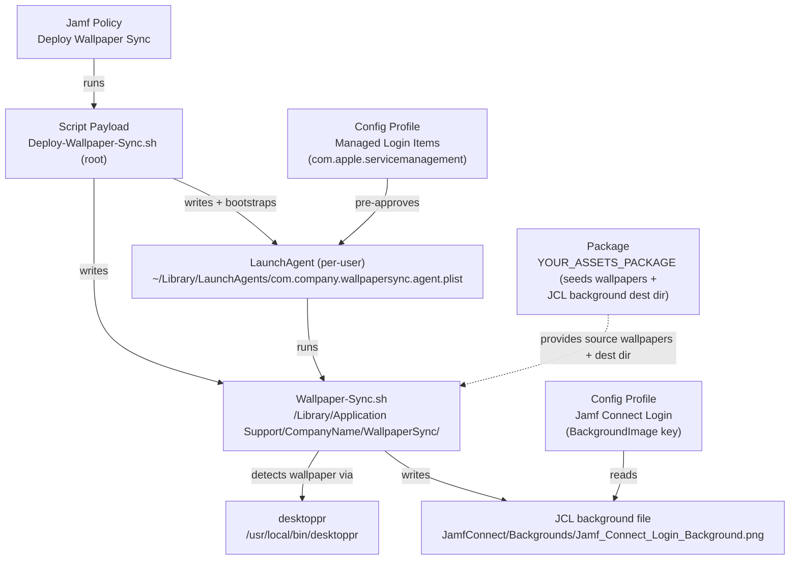
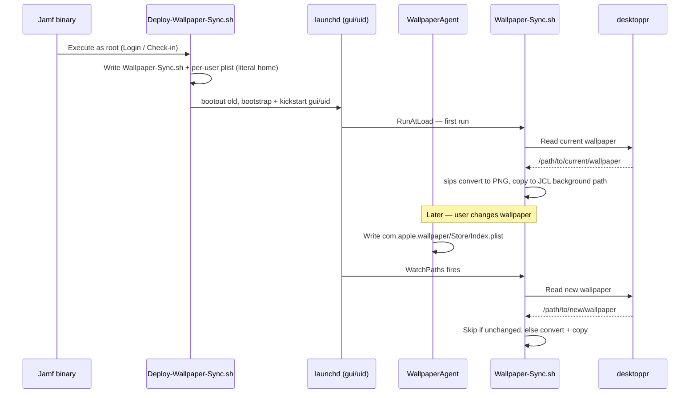

# Wallpaper Sync (Jamf Connect Login Background) — Deployment Guide

> **ℹ️ Note:** This guide is written for engineers new to MDM. Every
> MDM-specific term is linked to the [Apple Platform Glossary](../../apple-platform-glossary.md)
> on first mention. If a term is unfamiliar, click through before reading on.

**Script:** `Deploy-Wallpaper-Sync.sh`
**Version documented:** `1.8`
**Author:** Heath Jones
**Last updated:** 2026-10-04
**Target platform:** macOS `13+` (validated on `26.5.1`) managed by [Jamf Pro](../../apple-platform-glossary.md#jamf-pro)

---

## 1. Overview

This solution keeps the [Jamf Connect](../../apple-platform-glossary.md#jamf-connect) Login (JCL) screen
background in sync with whatever desktop wallpaper the logged-in user has currently set. Whenever the
user changes their wallpaper, the JCL login background is automatically updated to match, so the login
screen a user sees reflects their own desktop.

It is delivered as a **single [Jamf Pro](../../apple-platform-glossary.md#jamf-pro) [Script payload](../../apple-platform-glossary.md#script-payload)** —
`Deploy-Wallpaper-Sync.sh` — that runs as [root](../../apple-platform-glossary.md#root-context) and, via
[heredocs](../../apple-platform-glossary.md#heredoc), writes two on-disk artifacts: a per-user sync script
(`Wallpaper-Sync.sh`) and a [LaunchAgent](../../apple-platform-glossary.md#launchagent) that runs it in the
user's session. A companion [Configuration Profile](../../apple-platform-glossary.md#configuration-profile)
(`com.apple.servicemanagement`) pre-approves the agent as a Managed Login Item so macOS 13+ doesn't
suppress it. Wallpaper detection uses the `desktoppr` binary (a private API — **no
[PPPC/TCC](../../apple-platform-glossary.md#tcc) prompt required**).

**What gets deployed:**
- `Deploy-Wallpaper-Sync.sh` — the installer, run once per user session by a Jamf Policy (root context).
- `Wallpaper-Sync.sh` — the per-user sync script the installer writes to `/Library/Application Support/CompanyName/WallpaperSync/`.
- `com.company.wallpapersync.agent.plist` — a per-user LaunchAgent the installer writes to the user's `~/Library/LaunchAgents/`.
- `ManagedLoginItems-wallpapersync.mobileconfig` — Configuration Profile that pre-approves the agent as a Managed Login Item.

**What the end user sees:** Nothing — this runs silently. The only visible effect is that the JCL login background matches their current wallpaper.

**Runs as:** Mixed. The installer runs as [root](../../apple-platform-glossary.md#root-context); the sync agent it deploys runs in [user context](../../apple-platform-glossary.md#user-context).

**Runs when:** The installer Policy runs on a [Login](../../apple-platform-glossary.md#trigger) or [Recurring Check-in](../../apple-platform-glossary.md#recurring-check-in) trigger (must run while the user is logged in — the agent is per-user). The sync agent then runs on its own: once at load (`RunAtLoad`) and on every wallpaper change via [WatchPaths](../../apple-platform-glossary.md#watchpath).

---

## 2. Architecture

### Component diagram



### Runtime sequence



### How the components relate

The **Jamf Policy** is the only thing you deploy and scope. It runs `Deploy-Wallpaper-Sync.sh` as
[root](../../apple-platform-glossary.md#root-context). That installer is self-contained: it writes the
per-user sync script to a shared, world-readable path under `/Library/Application Support/CompanyName/`,
resolves the current [console user](../../apple-platform-glossary.md#console-user) and their home directory,
then writes a per-user LaunchAgent into that user's `~/Library/LaunchAgents/` with the user's **literal**
home path baked in. It boots out any prior copy, bootstraps the new one into the user's GUI domain, and
`kickstart`s it so it runs immediately.

From that point the installer is out of the picture. The **LaunchAgent** owns the ongoing behavior. It
runs the **sync script** once at load and again every time the watched wallpaper file changes. The sync
script reads the current wallpaper with **`desktoppr`** (private API, no AppleEvents, hence no
[PPPC](../../apple-platform-glossary.md#tcc) dependency), normalizes it to PNG with `sips`, and writes it to
the JCL background path.

State boundaries:
- **Root context:** only the installer. It writes the shared sync script and the per-user plist, and does the `launchctl bootstrap`.
- **User context:** the sync agent. It writes the JCL background file (the destination directory's permissions were intentionally loosened so a standard user can write there — see [Section 4.2](#42-prerequisite-jamf-pro-objects-and-endpoint-state)).
- **Source of truth for "did the wallpaper change":** a small state file at `~/Library/Application Support/CompanyName/WallpaperSync/last_source.state` (source path + size + mtime), which lets redundant triggers become cheap no-ops.
- **The Managed Login Items profile** is what keeps macOS 13+ from suppressing the agent as an unapproved background item; it matches the agent by its launchd `Label`.

---

## 3. Component Inventory

### On-endpoint files

| Name | Path | Delivery mechanism | Purpose |
|---|---|---|---|
| `Deploy-Wallpaper-Sync.sh` | Runs from the Jamf temp path (not persisted) | [Jamf policy](../../apple-platform-glossary.md#policy) [Script payload](../../apple-platform-glossary.md#script-payload) | Installer — writes the two artifacts below and bootstraps the agent |
| `Wallpaper-Sync.sh` | `/Library/Application Support/CompanyName/WallpaperSync/Wallpaper-Sync.sh` | Written by the installer via heredoc (`root:wheel`, `755`) | Detects current wallpaper and writes it to the JCL background path |
| `com.company.wallpapersync.agent.plist` | `~/Library/LaunchAgents/com.company.wallpapersync.agent.plist` (per user) | Written by the installer via heredoc (owned by the user, `644`) | [LaunchAgent](../../apple-platform-glossary.md#launchagent) — runs the sync script at load and on wallpaper change |
| `last_source.state` | `~/Library/Application Support/CompanyName/WallpaperSync/last_source.state` | Written by the sync script | No-op guard: remembers the last synced wallpaper |
| `wallpaperSync.log` | `~/Library/Logs/CompanyName/wallpaperSync.log` | Written by the sync script | Per-user log for the agent |
| JCL background image | `/Library/Application Support/CompanyName/JamfConnect/Backgrounds/Jamf_Connect_Login_Background.png` | Written by the sync script | The file the JCL profile's `BackgroundImage` key points at |

> **⚠️ Warning:** The JCL background path above must match the `BackgroundImage`
> value in your Jamf Connect Login profile **exactly**, and must match
> `JCL_BACKGROUND_DIR` / `JCL_BACKGROUND_FILENAME` in the installer. If the
> package pre-creates the JCL background directory in a different location than the scripts
> write to, the login background will silently never update.

### Jamf Pro objects

| Object type | Name | Purpose | Lives at |
|---|---|---|---|
| [Script](../../apple-platform-glossary.md#script-payload) | `Deploy Wallpaper Sync` | The installer script payload | `Settings → Computer Management → Scripts` |
| [Policy](../../apple-platform-glossary.md#policy) | `Deploy Wallpaper Sync` | Runs the installer in each user session | `Computers → Policies` |
| [Configuration Profile](../../apple-platform-glossary.md#configuration-profile) | `Managed Login Items — Wallpaper Sync` | Pre-approves the agent (Login Items / BTM) | `Computers → Configuration Profiles` |
| [Configuration Profile](../../apple-platform-glossary.md#configuration-profile) | *(existing)* `Jamf Connect Login` | Owns the `BackgroundImage` key — external dependency | `Computers → Configuration Profiles` |
| [Package](../../apple-platform-glossary.md#package) | `YOUR_ASSETS_PACKAGE` *(placeholder — your own wallpaper assets package)* | Seeds source wallpapers + the JCL background destination directory | `Settings → Computer Management → Packages` |
| [Category](../../apple-platform-glossary.md#category) | `Provisioning` (or your choice) | Organizes the Policy/Script/Profile | `Settings → Global → Categories` |

There is **no [Extension Attribute](../../apple-platform-glossary.md#extension-attribute-ea), no
[Smart Group](../../apple-platform-glossary.md#smart-group) requirement, and no
[API](../../apple-platform-glossary.md#api-role) usage** for this deployment (a Smart Group is optional, for
scoping by OS — see Section 6.4).

### Script parameters

`Deploy-Wallpaper-Sync.sh` reads only one optional Jamf parameter. `$1–$3` are reserved by Jamf (mount
point, computer name, username). The org identity and JCL destination are **edited inline at the top of
the script**, not passed as parameters.

| Position | Label in Jamf UI | Purpose | Example value | Required |
|---|---|---|---|---|
| `$4` | `Mode` | Operation mode | `install` (default), `uninstall`, `status` | No |

> **ℹ️ Note:** Leave `$4` blank for normal deployment — the script defaults to
> `install`. Use `uninstall` / `status` in a separate Policy or ad-hoc run.

### Inline configuration (edit before uploading)

These `readonly` constants at the top of `Deploy-Wallpaper-Sync.sh` are the single source of truth and are
interpolated into the artifacts it writes:

| Constant | Purpose | Shipped value |
|---|---|---|
| `ORG_NAME_FRIENDLY` | Display name; derives `ORG_NAME` (path-safe) | `Company Name` *(template default — CHANGE_ME; the installer refuses to run until changed)* |
| `ORG_PLIST_DOMAIN` | Reverse-DNS for the agent `Label` / log labels | `com.company` *(template default — CHANGE_ME)* |
| `JCL_BACKGROUND_DIR` | Directory the JCL `BackgroundImage` points into | `/Library/Application Support/${ORG_NAME}/JamfConnect/Backgrounds` (CHANGE_ME) |
| `JCL_BACKGROUND_FILENAME` | Exact filename JCL expects | `Jamf_Connect_Login_Background.png` |
| `MANAGED_ONLY` | Optional lock: when `"true"`, only sync wallpapers whose source is under `MANAGED_WALLPAPER_DIR` (personal wallpapers ignored) | `false` |
| `MANAGED_WALLPAPER_DIR` | The corporate wallpaper directory used by `MANAGED_ONLY` | `/Library/Application Support/${ORG_NAME}/Wallpapers` (CHANGE_ME) |

**Advanced sync-body constants** (in the embedded `Wallpaper-Sync.sh`, edit only if needed):

| Constant | Purpose | Default |
|---|---|---|
| `IGNORE_WALLPAPER_PREFIXES` | Source-path prefixes never synced — macOS default/stock wallpapers. Prevents the login/logout default from landing on the JCL background. | `/System/Library/`, `/Library/Desktop Pictures/`, `/Library/Application Support/com.apple.idleassetsd/` |
| `WALLPAPER_SETTLE_SECS` / `WALLPAPER_SETTLE_MAX_TRIES` | Settle window — waits for `desktoppr` to report the same value twice before syncing, so brief transitions aren't captured. | `2` / `4` |

> **ℹ️ Note:** Two layers keep the transient macOS **default** wallpaper off the
> login screen: the **settle loop** absorbs brief mid-session flashes, and the
> **`IGNORE_WALLPAPER_PREFIXES` denylist** blocks the default at the login/logout
> boundary (where it is stable for several seconds). For an absolute lock to
> corporate wallpapers, set `MANAGED_ONLY="true"`.

### Configuration Profile preference domain

**Preference domain:** `com.apple.servicemanagement` (Apple-defined — this is not a custom `defaults` domain)
**Delivered via:** `Computers → Configuration Profiles → Managed Login Items — Wallpaper Sync`

| Key | Type | Value | Purpose |
|---|---|---|---|
| `Rules` | Array | one rule dict | The set of Managed Login Item rules |
| `Rules[].RuleType` | String | `Label` | Match the agent by its launchd `Label` (unsigned bash agent — no Team ID) |
| `Rules[].RuleValue` | String | `com.company.wallpapersync.agent` | Must equal the LaunchAgent `Label` exactly |
| `Rules[].Comment` | String | *(descriptive)* | Human-readable note |

---

## 4. Dependencies and Prerequisites

### 4.1 Endpoint binaries

| Binary | Required version | Install mechanism | Detection command |
|---|---|---|---|
| `desktoppr` | Any current | Deploy separately (e.g. a Jamf package built from the desktoppr GitHub releases); the installer warns if missing | `/usr/local/bin/desktoppr --version` |
| `sips` | Built-in | macOS baseline | `which sips` |
| `plutil` | Built-in | macOS baseline | `which plutil` |

### 4.2 Prerequisite Jamf Pro objects and endpoint state

These must be true before the installer Policy will produce a working result:

- [ ] [Category](../../apple-platform-glossary.md#category) `Provisioning` (or your chosen category) exists.
- [ ] The **existing Jamf Connect Login [Configuration Profile](../../apple-platform-glossary.md#configuration-profile)** is deployed and its `BackgroundImage` key points at the exact path in Section 3.
- [ ] The **JCL background directory permissions are already loosened** so a standard user can write the background file there. *(This was done separately; the installer never `chmod`s it.)*
- [ ] Your **wallpaper assets [package](../../apple-platform-glossary.md#package)** (`YOUR_ASSETS_PACKAGE`) is deployed (via [PreStage](../../apple-platform-glossary.md#prestage-enrollment) or policy) so the source wallpapers exist on disk.
- [ ] `desktoppr` is present at `/usr/local/bin/desktoppr`.
- [ ] The **Managed Login Items profile** is deployed alongside the installer Policy (see Section 6.5).

### 4.3 Network reachability

*None required.* This solution is entirely local — no URLs, no API calls, no proxy considerations.

### 4.4 Credentials and secrets

*None required.* No API clients, keychain items, or secrets of any kind.

---

## 5. Pre-Deployment Checklist

- [ ] Script has been reviewed, tested locally, and is the final version (`1.8`).
- [ ] Inline constants edited: `ORG_NAME_FRIENDLY`, `ORG_PLIST_DOMAIN`, `JCL_BACKGROUND_DIR`, `JCL_BACKGROUND_FILENAME`.
- [ ] All Section 4 dependencies satisfied (JCL profile, loosened dest dir, wallpaper assets package, `desktoppr`).
- [ ] The Managed Login Items `.mobileconfig` `RuleValue` equals `com.company.wallpapersync.agent`.
- [ ] A test Mac is enrolled and logged in as a standard user.
- [ ] You have Jamf Pro admin privileges (`Settings → System → Jamf Pro User Accounts & Groups`).
- [ ] You tested the installer locally (see Section 6.1) and confirmed exit code `0`.
- [ ] The [Category](../../apple-platform-glossary.md#category) exists.

---

## 6. Deployment Procedure

### 6.1 Local testing before uploading to Jamf

The installer must run **while a user is logged in** (the agent is per-user). On a test Mac, logged in as
a standard user, from an admin Terminal:

```bash
sudo /path/to/Deploy-Wallpaper-Sync.sh install

# In a second Terminal tab, watch the installer log:
log stream --predicate 'eventMessage CONTAINS "com.company.Deploy-Wallpaper-Sync"' --info --debug
```

Expected outcomes:
- Exit code `0`.
- `Wallpaper-Sync.sh` exists at `/Library/Application Support/CompanyName/WallpaperSync/` (`755`, `root:wheel`).
- The per-user plist exists at `~/Library/LaunchAgents/com.company.wallpapersync.agent.plist` (owned by the user).
- The agent is loaded: `launchctl print gui/$(id -u)/com.company.wallpapersync.agent` succeeds.
- The JCL background file exists and matches the current wallpaper.
- Installer log shows `Deploy-Wallpaper-Sync.sh v1.8 starting` and `completed successfully`.

Then verify the ongoing behavior — change the wallpaper in **System Settings → Wallpaper** and confirm
the agent fires:

```bash
tail -f ~/Library/Logs/CompanyName/wallpaperSync.log
# Expect: "Current wallpaper: …" then "JCL background updated: …" within a second or two
```

If the installer fails locally, fix before uploading. Do **not** upload a broken script to Jamf.

### 6.2 Create the [Script payload](../../apple-platform-glossary.md#script-payload) in Jamf Pro

1. In Jamf Pro, go to **Settings → Computer Management → Scripts**.
2. Click **+ New**.
3. **General** tab:
   - **Display Name:** `Deploy Wallpaper Sync`
   - **Category:** `Provisioning`
   - **Notes:** link to this guide's Confluence URL once published.
4. **Script** tab: paste the entire contents of `Deploy-Wallpaper-Sync.sh`, including the shebang and banner blocks.
5. **Options** tab:
   - **Priority:** `After`.
   - **Parameter Label 4:** `Mode` (install | uninstall | status).
6. **Limitations** tab: leave at defaults.
7. Click **Save**.

### 6.3 Create the [Extension Attribute](../../apple-platform-glossary.md#extension-attribute-ea)

*Not applicable for this deployment.*

### 6.4 Create the [Smart Group](../../apple-platform-glossary.md#smart-group) that scopes the Policy

Optional. A Smart Group is not required, but scoping by OS version is sensible.

1. Go to **Computers → Smart Computer Groups → + New**.
2. **Display Name:** `macOS — Jamf Connect Login Macs`
3. **Criteria** tab: e.g. `Operating System Version` `like` `13.` (add rows / adjust for your fleet), and/or membership in your Jamf Connect scope group.
4. Click **Save**.

Otherwise scope the Policy directly to your existing Jamf Connect population.

### 6.5 Create the [Configuration Profile](../../apple-platform-glossary.md#configuration-profile) (Managed Login Items)

1. Go to **Computers → Configuration Profiles → + New**.
2. **General** payload:
   - **Name:** `Managed Login Items — Wallpaper Sync`
   - **Category:** `Provisioning`
   - **Distribution Method:** `Install Automatically`
   - **Level:** `Computer Level`
3. Add the **`com.apple.servicemanagement`** payload by uploading the signed/unsigned
   `ManagedLoginItems-wallpapersync.mobileconfig`, or build it in the UI with a single `Rules` entry:
   `RuleType = Label`, `RuleValue = com.company.wallpapersync.agent`.
4. **Scope** tab: target the same population as the installer Policy.
5. Click **Save** and deploy.

> **⚠️ Warning:** Deploy this profile **together with** the installer Policy
> (same policy run / [PreStage](../../apple-platform-glossary.md#prestage-enrollment)).
> On macOS 13+ (Ventura and later), deploying the agent without this profile
> means macOS surfaces it as an unapproved background item in
> **System Settings → General → Login Items**, and it may not run until a user
> manually approves it — silently breaking the sync. The profile must be
> MDM-delivered; it cannot be installed by double-clicking.

### 6.6 Create the [Policy](../../apple-platform-glossary.md#policy)

1. Go to **Computers → Policies → + New**.
2. **General** payload:
   - **Display Name:** `Deploy Wallpaper Sync`
   - **Enabled:** checked
   - **Category:** `Provisioning`
   - **Trigger:** **Login** (recommended — guarantees a logged-in user for the per-user agent). Optionally also **Recurring Check-in** as a self-heal.
   - **Execution Frequency:** `Once per user per computer` (installs once per user; re-runnable safely if you flush).
3. **Packages** payload → **Configure** → add your wallpaper assets package (if you deliver the wallpapers via this same Policy rather than PreStage), **Priority `Before`** so the source images exist before the script runs.
4. **Scripts** payload → **Configure → Add** the `Deploy Wallpaper Sync` script:
   - **Priority:** `After`.
   - **Mode (`$4`):** leave blank (defaults to `install`).
5. **Scope** tab:
   - **Targets** → **+ Add** → your Smart Group or Jamf Connect population.
   - **Exclusions** → add your admin test fleet during initial rollout.
6. Click **Save**.

> **✅ Tip:** Because the agent is **per-user**, the installer must run inside
> each user's session. A **Login**-triggered Policy set to
> `Once per user per computer` is the clean way to guarantee that on shared or
> re-imaged Macs.

### 6.7 Self Service variant

*Not applicable — this deployment runs silently via Login / check-in trigger only.*

### 6.8 Ongoing-trigger variant

Optional self-heal: add **Recurring Check-in** with **Execution Frequency `Ongoing`**. The installer is
idempotent (it boots out and re-bootstraps cleanly and removes any legacy shared copy), so re-runs are
safe and cheap.

---

## 7. Validation / Smoke Test

### On the test Mac

```bash
# Run the installer via the policy
sudo jamf policy -event login   # or: sudo jamf policy

# Installer artifacts
ls -l "/Library/Application Support/CompanyName/WallpaperSync/Wallpaper-Sync.sh"
ls -l ~/Library/LaunchAgents/com.company.wallpapersync.agent.plist

# Agent loaded for the console user?
launchctl print gui/$(id -u)/com.company.wallpapersync.agent | grep -Ei 'state|runs|watchpath'

# The legacy shared copy should be GONE (installer self-cleans it)
ls -l /Library/LaunchAgents/com.company.wallpapersync.agent.plist 2>&1

# The JCL background file exists
ls -l "/Library/Application Support/CompanyName/JamfConnect/Backgrounds/Jamf_Connect_Login_Background.png"

# Status mode (human-readable summary)
sudo /path/to/Deploy-Wallpaper-Sync.sh status
```

Then **change the wallpaper** and confirm the sync agent fires:

```bash
tail -f ~/Library/Logs/CompanyName/wallpaperSync.log
```

**Expected:**
- `/var/log/jamf.log` shows the Policy executed and `Script exit code: 0`.
- The agent is loaded and its `WatchPaths` include `com.apple.wallpaper/Store/Index.plist`.
- Changing the wallpaper produces a fresh `JCL background updated: …` log line within seconds.
- Logging out shows the JCL login screen using the new wallpaper.

### In Jamf Pro

1. Go to **Computers → Search Inventory → `<test computer>`**.
2. Open **History → Policy Logs**, find the `Deploy Wallpaper Sync` run, click **View Log**, confirm success.
3. Confirm both Configuration Profiles (Managed Login Items + Jamf Connect Login) show as installed under the computer's **Profiles**.

---

## 8. Troubleshooting

### 8.1 Exit code reference

The installer and the sync agent use simple exit codes and write the human-readable reason to the log
before exiting — the **log is the truth**, the exit code is a hint.

| Exit code | Meaning | Recommended action |
|---|---|---|
| `0` | Success | No action needed |
| `1` | General failure — placeholder org identity still set, no console user home, failed heredoc write / plist lint, `desktoppr` missing, source/dest issue | Read the log line immediately preceding the exit (see 8.2) |

### 8.2 Unified log predicates

The installer logs under `com.company.Deploy-Wallpaper-Sync`; the per-user sync agent logs under
`com.company.Wallpaper-Sync` (and to `~/Library/Logs/CompanyName/wallpaperSync.log`).

**Installer — last hour:**
```bash
log show --predicate 'eventMessage CONTAINS "com.company.Deploy-Wallpaper-Sync"' --info --last 1h
```

**Sync agent — last hour:**
```bash
log show --predicate 'eventMessage CONTAINS "com.company.Wallpaper-Sync"' --info --last 1h
```

**Sync agent — errors only:**
```bash
log show --predicate 'eventMessage CONTAINS "com.company.Wallpaper-Sync" AND messageType == error' --last 24h
```

**Live tail during a test:**
```bash
log stream --predicate 'eventMessage CONTAINS "Wallpaper-Sync"' --info --debug
```

**launchd's view (why an agent won't spawn):**
```bash
log show --predicate 'process == "launchd"' --last 15m | grep -i wallpapersync
```

### 8.3 Policy log locations

| Location | Use when |
|---|---|
| `/var/log/jamf.log` on the endpoint | Live/post-mortem of the installer Policy on one Mac |
| `~/Library/Logs/CompanyName/wallpaperSync.log` | The per-user sync agent's own log |
| `Computers → <record> → History → Policy Logs` in Jamf Pro | Reviewing across the fleet |

### 8.4 Common failure modes

#### Symptom: agent runs at load but never re-fires on wallpaper change

| Root cause | Diagnostic | Resolution |
|---|---|---|
| Watching the wrong file on macOS 14+ | `stat -f '%Sm' ~/Library/Application\ Support/Dock/desktoppicture.db` shows an old date; `…/com.apple.wallpaper/Store/Index.plist` updates on change | Ensure you deployed installer **v1.2+**, which watches `com.apple.wallpaper/Store/Index.plist`. Re-run the installer. |
| WatchPaths didn't arm | `launchctl print gui/$(id -u)/com.company.wallpapersync.agent` shows no watch paths | Re-run the installer (rewrites plist + re-bootstraps). |

#### Symptom: nothing runs at load; only works when run by hand

| Root cause | Diagnostic | Resolution |
|---|---|---|
| `~` in plist paths not expanded by launchd | `log show --predicate 'process == "launchd"' ... \| grep -i wallpapersync` shows "Could not open … No such file or directory" | Fixed in **v1.1+** (per-user install with literal home paths). Re-run the installer. |
| Managed Login Items profile missing | Agent listed as unapproved in **System Settings → General → Login Items** | Deploy the `com.apple.servicemanagement` profile (Section 6.5). |

#### Symptom: JCL background never changes even though the file is written

| Root cause | Diagnostic | Resolution |
|---|---|---|
| Path mismatch between where the script writes and where JCL reads | Compare `JCL_BACKGROUND_DIR`/`_FILENAME` to the JCL profile's `BackgroundImage` and to the packaged destination directory location | Make all three identical; re-run installer. |
| Destination dir not user-writable | `wallpaperSync.log` shows "Failed to stage image … permissions loosened?" | Ensure the JCL dir permissions were loosened for standard users. |
| Background file mode `0600` (root-only readable) | `ls -l` on the JCL image shows `-rw-------` | Fixed in v1.4+ (installer chmods `644` before the atomic move). Re-run installer; `chmod 644` the existing file once. |

#### Symptom: JCL login screen shows the DEFAULT wallpaper (or the file briefly becomes the default)

At early login and at logout, macOS reports the **default** wallpaper as the current one, and it is *stable*
for several seconds (not a brief flash) while no real wallpaper is applied.

| Root cause | Diagnostic | Resolution |
|---|---|---|
| Agent captured the stable default at the login/logout boundary | `wallpaperSync.log` shows `Current wallpaper:` pointing at a `/System/Library/…` (or aerial) path being synced | Fixed in v1.6+ via `IGNORE_WALLPAPER_PREFIXES`. Confirm the log shows `Ignoring system/default wallpaper …` at login. |
| Default resolves to a path not in the denylist | Log shows the default being synced from an unexpected prefix | Add that prefix to `IGNORE_WALLPAPER_PREFIXES` in the sync body and re-run the installer. |
| Absolute lock required | Any personal wallpaper is unwanted on the login screen | Set `MANAGED_ONLY="true"` — only wallpapers under `MANAGED_WALLPAPER_DIR` sync, so the default can never land regardless of its path. |
| File is correct on disk but JCL still shows old image | JCL background file matches the current wallpaper, but the login window shows the previous one | Jamf Connect Login reads `BackgroundImage` when the login window is presented — it does not hot-reload. Verify at the **next full logout/restart**, not a screen lock or fast-user-switch. |

#### [BASELINE] Script runs manually but fails under Jamf policy

| Root cause | Diagnostic | Resolution |
|---|---|---|
| `PATH` not exported | `command not found` in the policy log | Installer exports `PATH` near the top — confirm it wasn't edited out. |
| No logged-in user at run time | Installer log: "No active console user — … needs a logged-in user" | Use a **Login** trigger; the per-user agent requires a session. |

#### [BASELINE] "Operation not permitted" / permission errors

| Root cause | Diagnostic | Resolution |
|---|---|---|
| Writing to a [SIP](../../apple-platform-glossary.md#sip)-protected path | Error references `/System` etc. | N/A here — all writes are under `/Library/Application Support` and the user home. |
| Bootstrap into the wrong domain | `launchctl bootstrap` warning in installer log | Confirm the console user resolved; installer bootstraps `gui/<uid>`. |

#### [BASELINE] Policy never runs on the target Mac

| Root cause | Diagnostic | Resolution |
|---|---|---|
| Mac out of scope | `Computers → <record> → Smart/Static Groups` | Fix scope; `sudo jamf recon`. |
| Frequency exhausted | Policy `Once per user per computer` already ran | Flush Policy logs to re-run. |

### 8.5 Validation one-liners

```bash
# Is the sync script deployed?
ls -l "/Library/Application Support/CompanyName/WallpaperSync/Wallpaper-Sync.sh"

# Is the per-user agent loaded?
launchctl print gui/$(id -u)/com.company.wallpapersync.agent >/dev/null 2>&1 && echo "loaded" || echo "NOT loaded"

# Are the WatchPaths correct?
launchctl print gui/$(id -u)/com.company.wallpapersync.agent | grep -iA4 watchpath

# Did the legacy shared copy get cleaned up?
test -f /Library/LaunchAgents/com.company.wallpapersync.agent.plist && echo "LEGACY STILL PRESENT" || echo "clean"

# Is the JCL background file present and recent?
ls -l "/Library/Application Support/CompanyName/JamfConnect/Backgrounds/Jamf_Connect_Login_Background.png"

# What did desktoppr detect?
/usr/local/bin/desktoppr | head -1

# Latest sync-agent log lines
tail -20 ~/Library/Logs/CompanyName/wallpaperSync.log
```

---

## 9. Rollback and Uninstall

### 9.1 Stop execution

1. In Jamf Pro, disable the `Deploy Wallpaper Sync` Policy (`General → Enabled` → uncheck → **Save**).
2. Remove the `Managed Login Items — Wallpaper Sync` Configuration Profile from scope (this un-approves the agent).

### 9.2 Remove endpoint artifacts

Run the installer's built-in uninstall (per logged-in user), or deploy it as an uninstall Policy with `$4 = uninstall`:

```bash
sudo /path/to/Deploy-Wallpaper-Sync.sh uninstall
```

`uninstall` boots out the agent, removes the per-user plist and any legacy `/Library/LaunchAgents` copy,
and deletes `/Library/Application Support/CompanyName/WallpaperSync/`. It runs against the **current
console user**; for multi-user Macs, run it once per user session, and remove other users' copies:

```bash
# For each other user, as needed:
rm -f "/Users/<user>/Library/LaunchAgents/com.company.wallpapersync.agent.plist"
rm -rf "/Users/<user>/Library/Application Support/CompanyName/WallpaperSync"
```

> **ℹ️ Note:** Uninstall does **not** delete the JCL background image or the
> wallpaper assets package contents — those are owned by other deployments. Remove them
> only if you're retiring the whole wallpaper program.

### 9.3 Remove Jamf Pro objects

Delete in this order:

1. The `Deploy Wallpaper Sync` Policy.
2. The `Deploy Wallpaper Sync` Script payload.
3. The `Managed Login Items — Wallpaper Sync` Configuration Profile.
4. The scoping Smart Group (only if not used elsewhere).
5. Your wallpaper assets package (only if retiring the wallpaper program).

### 9.4 Force reporting update

Run `sudo jamf recon` on affected Macs so group membership and profile state refresh in Jamf Pro.

---

## 10. Change Log

| Version | Date | Author | Change |
|---|---|---|---|
| 1.0 | 2026-07-02 | Heath Jones | Initial release — self-installing deployer (heredocs) + bootstrap. |
| 1.1 | 2026-07-03 | Heath Jones | Per-user install with literal home paths (fixes RunAtLoad not firing due to unexpanded `~`); added legacy cleanup + `kickstart`. |
| 1.2 | 2026-07-03 | Heath Jones | Watch `com.apple.wallpaper/Store/Index.plist` (macOS 14+ wallpaper store) so the agent re-fires on wallpaper change; kept legacy DB for macOS 13. |
| 1.3 | 2026-07-03 | Heath Jones | Added optional `MANAGED_ONLY` mode — only sync wallpapers under `MANAGED_WALLPAPER_DIR`. Embedded `Wallpaper-Sync.sh` → v1.1. |
| 1.4 | 2026-07-03 | Heath Jones | `chmod 644` the JCL background before the atomic move (was inheriting `mktemp`'s `0600`, unreadable by the loginwindow). Embedded → v1.2. |
| 1.5 | 2026-07-03 | Heath Jones | Added settle loop (`detect_settled_wallpaper`) so brief transitions aren't captured. Embedded → v1.3. |
| 1.6 | 2026-07-07 | Heath Jones | Added `IGNORE_WALLPAPER_PREFIXES` denylist so the macOS default (stable at login/logout) never syncs to the JCL background. Embedded → v1.4. |
| 1.7 | 2026-10-04 | Heath Jones | Public release prep: sanitized identifiers (org identity back to template defaults, JCL/managed paths derive from `ORG_NAME`), expert-bash conformance, `check_dependencies` warn-only preflight. Embedded → v1.5. |
| 1.8 | 2026-10-04 | Heath Jones | Renamed to Name-Of-Script.sh convention: installer is `Deploy-Wallpaper-Sync.sh`, deployed agent script is `Wallpaper-Sync.sh` (pre-rename copy removed on upgrade); log labels follow the new names. Embedded → v1.6. |

---

**Related documentation:**
- [Apple Platform Glossary](../../apple-platform-glossary.md)
- `Wallpaper-Sync-Tech-Guide.md` (Service Desk triage)
- `Wallpaper-Sync-User-Guide.md` (end-user note)
